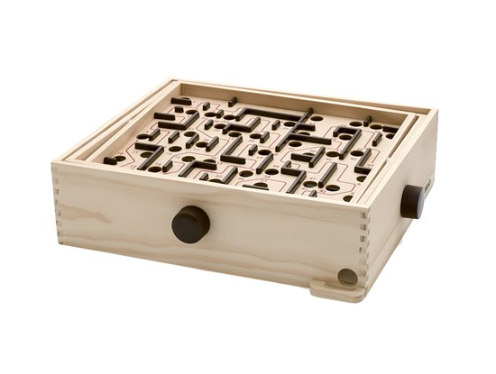
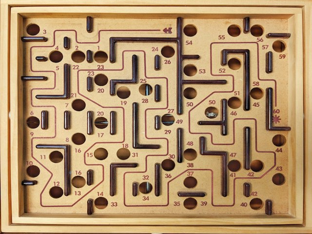

---
bibliography:
- References.bib
csl: apa.csl
nocite: | 
  @hafiz1891divan, @ayazifar1992pel, @wickham2018rstudio, @wickham2016ggplot2, @team2015rstudio, @wickham2017tidyverse, @team2013r
fontsize: 12pt
geometry: margin = 1 in
header-includes:
    
- \usepackage{placeins}
- \usepackage{setspace}
- \usepackage{chngcntr}
- \counterwithin{figure}{section}
- \counterwithin{table}{section}
indent: yes
linestretch: 2
linkcolor: black
output:
  pdf_document:
    fig_caption: yes
    includes:
      in_header: preamble-latex.tex
    number_sections: yes
  html_document:
    df_print: paged
  word_document:
    fig_caption: yes
urlcolor: black
---

\begin{singlespace}
\begin{titlepage}
    \begin{center}
\vspace*{2.5cm}
        
\LARGE
The Effects of Self-Guided Meditation and Napping on Memory Consolidation in Humans
        
\vspace{2.5cm}
\large
By
        
\vspace{1.5cm}
        
Mohammad Dastgheib

\vspace{1.5 cm}

        
A thesis submitted to the Department of Psychology\\
in conformity with the requirements for\\
the degree of Master of Science 

        
\vfill
        
       

\vspace{0.8cm}

      
\normalsize
Queen's University\\
		Kingston, Ontario, Canada\\
		January, 2020 \\
\vspace{0.8cm}
        Copyright {\copyright}  Mohammad Dastgheib, 2020

    \end{center}
\end{titlepage}
\end{singlespace}
\newpage

# Abstract {.unnumbered}

<!-- This is the abstract -->

Numerous studies have reported that, compared to an equivalent period of wakefulness, post-training sleep (overnight or daytime naps) benefits memory consolidation [@plihal1999effects; @mednick2003sleep; @walker2003sleep; @diekelmann2010memory]. However, most investigations have employed various forms of "active wakefulness" (e.g., sensorimotor and cognitive tasks) as a comparison condition for sleep, while few studies have examined the role of "quiet wakefulness" in memory consolidation, even though some of the EEG oscillations during quiet waking resemble those present in sleep (e.g., increased activity in the theta-alpha range) [@brokaw2016resting]. \par
This study aimed to examine the consolidation of declarative (word-pair associates) and non-declarative (marble maze visuo-motor task) learning over a 60-minutes time interval (with continuous EEG monitoring) filled with either (A) napping; (B) active-waking (watching a video); or (C) quiet-waking (self-guided meditation). \par

The results of the current study suggested that memory consolidation may not be a sleep-specific-phenomenon. In fact, mindfulness meditation appeared to be more advantageous than a short nap for the consolidation of declarative memories. This study also found that SWS exerts significant effects on the retention of non-declarative memory. For nappers, the absence of SWS resulted in noticeable performance enhancements compared to participants who entered SWS. Thus, it is possible that SWS plays a disadvantageous role in the consolidation of procedural memory. It is thought that sleep inertia caused by SWS is partly responsible for the impairments in tasks procedural memory. \par
The findings of current study contribute to the understanding of memory consolidation and provide insights about the role of waking states for future studies.

\pagenumbering{roman}
\setcounter{page}{2}

\newpage

# Epigraph {.unnumbered}

\begin{singlespace}
\null\vfill
{
	
	\centering
	
		\raggedright{\large\itshape%
      In the morning, in a dream, I beheld the glance of union with Him: \\
	  Oh excellent! when the stage of sleeping better than the [stage of] waking is.\par\bigskip
	   
		\raggedleft\large{\textsc{--- \d{H}\={a}fe\d{z} of Sh\={i}r\={a}z (ca. 1315-1390)}}\par%
		
}}

\vfill\vfill
\end{singlespace}
\newpage

# Acknowledgements {.unnumbered}

Praise and glory are due, first and foremost, to Allah (SWT), the Lord of all there is. Were it not for His beneficence and mercy, I simply would not have been. He is the One from whose grace I have derived all my sustenance and strength, and He it is to whom I pledge my undivided alleginace.  

This thesis would not have been possible without the guidance of my advisor Dr. Hans Dringenberg. Through countless hours of meetings and an abundance of feedback, he helped shape this work. Hans’ considerations for the broader impacts of this research, as well as his emphasis on effective writing and presentation, were critical in every step of my graduate work. Hans' sharp intellect at identifying key issues and his clarity of vision were essential to my progress.

This thesis has also benefited from comments and suggestions made by Dr. Janet Menard and Dr. Jordan Poppenk who have read through the manuscript. I take this opportunity to thank them.

I am also thankful to my friends and colleagues at Sleep and Neuroplasticity Lab: Ms. Asvini Kulanayagam, who completed the pilot study of this work, and Ms. Liza Legro, who I had the pleasure of working alongside in the first year of this project. Mr. Matthew Stewart, who trained me on the EEG set up, analysis, and helped with scoring sleep records, and Ms. Katie McGuire for helping me run the experiments, and Mr. Hossein Mahdikhah, an insightful friend, who helped me with programming. And finally, Mr. Edwyn Lo, who was my lab mate, a supportive colleague, and my best friend throughout the past two years.

I would like to express my gratitude to my lovely grandparents, who from an early age inspired me to pursue my interests in science, for their love and encouragement in all my endeavors and for the value they placed on family. 

Finally, there are three very dear people whose acknowledgement I have deliberately postponed to the very last slot, because I have found it beyond my capabilities to express in words my true feelings toward them. They are my parents and my sister. I cannot even begin to imagine how a son is to thank two parents who give up a lifetime of their earnings to emigrate to a land two continents away, so that their children can be assured of a brighter future. I am a son in exactly that situation, and I can only hope that I have been able to deliver even a tiny fraction of what they have invested in me in both emotional and financial terms. Along with my sister, their love, affection, and support have been crucial in my survival, and I am eternally grateful to them for all their kindness.
<!-- Use the \newpage command to force a new page -->

\newpage
\begin{singlespace}
\pagenumbering{gobble}

\tableofcontents
\end{singlespace}


\newpage

# List of figures {.unnumbered}

<!--
For me, this was the only drawback of writing in Markdown: it is not possible to add a short caption to figures and tables. This means that the \listoftables and \listoffigures commands will generate lists using the full titles, which is probably isn't what you want. For now, the solution is to create the lists manually, when everything else is finished.
-->
\begin{singlespace}

Figure 1. Hypnogram . . . . . . . . . . . . . . . . . . . . . . . . . . . . . . . . . . . . . . . . . \hfill{6}
Figure 2. Brio Marble Maze . . . . . . . . . . . . . . . . . . . . . . . . . . . . . . . . . . . . .   \hfill{22}
Figure 3. Brio Marble Maze - Top . . . . . . . . . . . . . . . . . . . . . . . . . . . . . . . . . \hfill{22}
Figure 4. Electrode Placements . . . . . . . . . . . . . . . . . . . . . . . . . . . . . . . . . . . \hfill{24}
Figure 5. Distribution of G-Mean Values . . . . . . . . . . . . . . . . . . . . . . . . . . . . . \hfill{37}
Figure 6. Comparison of G-Mean Values . . . . . . . . . . . . . . . . . . . . . . . . . . . . .  \hfill{38}
Figure 7. Comparison of G-Mean Values in NAP . . . . . . . . . . . . . . . . . . . . . . . . .  \hfill{40}
Figure 8. Acquisition Curve of Learning and Retention . . . . . . . . . . . . . . . . . . . .    \hfill{42}
Figure 9. Distribution of the Difference of Median Values . . . . . . . . . . . . . . . . . . . \hfill{43}
Figure 10. Distribution of the Difference of Median Values in NAP . . . . . . . . . . . . .  \hfill{44}
Figure 11. Distribution of the Memory Retention Performance and SWS . . . . . . . . . .  \hfill{45}
Figure 12. Comparison of the Difference of Median Values in NAP . . . . . . . . . . . . .  \hfill{46}
Figure 13. Comparison of the Difference of Median Values  . . . . . . . . . . . . . . . . . . . \hfill{48}
Figure 14. Comparison of the Difference of Median Values - SWS Absent . . . . . . . . . . \hfill{50}
Figure 15. Comparison of the Difference of Median Values - SWS Present . . . . . . . . .  \hfill{51}
Figure 16. Probability of Being Male in a Declarative Memory Task . . . . . . . . . . . . .  \hfill{53}
Figure 17. Probability of Being Male in a Non-declarative Memory Task . . . . . . . . . . \hfill{54}
Figure 18. Scatter Plot of Decl. Memory Performance and Time in Meditation . . . . . . \hfill{56}
Figure 19. Scatter Plot of Non-decl. Memory Performance and Time in Meditation . . . . \hfill{57}
Figure 20. Scatter Plot of Decl. Memory Performance and Total Sleep Time . . . . . . .  \hfill{61}
Figure 21. Scatter Plot of Non-decl. Memory Performance and Total Sleep Time . . . . .  \hfill{62}
Figure 22. Scatter Plot of Decl. Memory Performance and Time in Stage 1 and 2 . . . . . \hfill{63}
Figure 23. Scatter Plot of Non-decl. Memory Performance and Time in Stage 1 and 2 . . . \hfill{65}

\end{singlespace}

\pagenumbering{roman}
\setcounter{page}{10}
\newpage


# List of tables {.unnumbered}

<!-- 
For me, this was the only drawback of writing in Markdown: it is not possible to add a short caption to figures and tables. This means that the \listoftables and \listoffigures commands will generate lists using the full titles, which is probably isn't what you want. For now, the solution is to create the lists manually, when everything else is finished.
-->
\begin{singlespace}

Table 1. Timeline of the study . . . . . . . . . . . . . . . . . . . . . . . . . . . . . . . . . . .  \hfill{19}  
Table 2. Confusion matrix . . . . . . . . . . . . . . . . . . . . . . . . . . . . . . . . . . . . . \hfill{26}  
Table 3. Participant demographics . . . . . . . . . . . . . . . . . . . . . . . . . . . . . . . . \hfill{31}  
Table 4. Sleep profile of participants . . . . . . . . . . . . . . . . . . . . . . . . . . . . . . .\hfill{32}  
Table 5. Breakdown of the performance . . . . . . . . . . . . . . . . . . . . . . . . . . . . . . \hfill{36}  
\end{singlespace}

\setcounter{page}{11}
\newpage

# List of Abbreviations{.unnumbered}

\begin{singlespace}
\begin{tabular}{lcl}
\\
\multicolumn{3}{l}{\textbf{Terms Related to Sleep}}\\
SWS & & Slow Wave Sleep \\
REM & \, & Rapid Eye Movement\\
\\
\multicolumn{3}{l}{\textbf{Terms related to Polysomnographic Recordings}}\\
EEG & & Electroencephalography \\
EOG & \, & Electro-oculography \\
EMG & \, & Electromyography \\
\\
\multicolumn{3}{l}{\textbf{Terms related to Declarative Memory Measurements}}\\
G-Mean & & Geometric Mean \\
TPR & \, & True Positive Rate \\
TNR & \, & True Negative Rate \\
\\
\multicolumn{3}{l}{\textbf{Terms related to Self-report Measures}}\\
ESS & & Epworth Sleepiness Scale \\
FMI & \, & Freiburg Mindfulness Inventory \\
EMG & \, & Electromyography \\
\\
\multicolumn{3}{l}{\textbf{Terms Related to Bayesian Inference}}\\
BF && Bayes Factor \\
CI & \, & Credible Interval \\
MAD & \, & Median Aboslute Deviation \\
MPE & \, & Maximum Probability of Effect \\
MCMC & \, & Markov Chain Monte Carlo \\
\end{tabular}
\end{singlespace}
\setcounter{page}{12}

\newpage
\setcounter{page}{1}
\renewcommand{\thepage}{\arabic{page}}
\newpage
# Chapter 1. {.unnumbered}
# Introduction 
## Historical background

In order to develop a more complete understanding of the relationship between sleep and memory, one must gain information regarding the systems of memory, the mechanisms of memory formation, as well as the characteristics and mechanisms of sleep.

## Systems of memory

Memory systems have been categorized into declarative and non-declarative memory (also known as procedural memory) [@squire1992memory]. This dichotomy is a widely used distinction in neuropsychological and cognitive studies of memory. In addition, some researches have introduced emotional memory as a separate type of memory system [@cahill1995amygdala]. However, for the purpose of the current thesis project, I will introduce and investigate only declarative and non-declarative memory. \par

### Declarative memory

Declarative memory describes the retention of, usually personal, events (episodic memory) and, usually general, facts and information (semantic memory) [@tulving1985classification]. Encoding of these types of memories is rapid, typically explicit, and short- and intermediate-term retrieval depends on the medial temporal lobe, predominantly the hippocampus. Further, declarative memories are highly susceptible to decay, interference and forgetting [@marshall2007contribution]. Although a link between the medial temporal lobe and declarative memory had been suggested more than a century ago [@von1900demonstration], Brenda Milner with the famous case of H.M. --an epileptic patient who became amnesic following the bilateral removal of hippocampi to alleviate his seizures--, documented a clear relationship between the loss of the medial temporal lobes and a severe impairment in declarative memory. As a consequence of his surgical operation, H.M. suffered from anterograde and temporally graded retrograde amnesia, but his perceptual and cognitive abilities, as well as his motor skills remained intact [@scoville1957loss; @milner1972disorders]. The work on H.M., and numerous neuropsychological studies on other amnesic patients confirmed the importance of hippocampal functioning for both the encoding and subsequent retrieval of declarative memories [@eichenbaum2004hippocampus]. \par

### Non–declarative memory

Non-declarative memory, also known as procedural memory, essentially describes the memories for perceptual stimuli, stimulus-response learning, and the acquisition of motor skills (e.g., playing a violin, athletic sports, etc.). Motor skills are broadly classified into motor sequence learning (e.g., learning a piano scale) and motor adaptation (learning to use game controller) [@spencer2017sleep]. Generally, non-declarative memory encoding can involve both explicit and implicit processes and the encoding and retrieval heavily rely on cortico-striatal and cortico-cerebellar loops. Within this memory system, the acquisition of skills is gradual and requires repeated practice; however, once automated, they remain relatively stable over time [@marshall2007contribution].\par

It should be noted that the neuroanatomical description of brain systems involved in the encoding and storage of declarative and non-declarative memories provided above is an over-simplification; as such, it does not capture the complexity and considerable overlap in the neuroanatomical networks that likely participate in the different types of memory. For instance, some fMRI studies have reported that the hippocampus is active during both explicit and implicit motor skill learning [@schendan2003fmri].\par  
<!-- I need to find more studies showing that hippocampus is involved in non-declarative memory -->

## Sleep architecture

<!-- Though in both sleep and coma, we are facing an impairment in conscious awareness, the distinction between sleep and coma is reversibility. Sleep is a transient, periodic, and reversible phenomenon. Therefore, we can define human sleep as an altered state of consciousness with different controls, rhythms, emotions, and dreams [@chokroverty2017overview].

**NEEDS PARAPHRASE**
Consciousness requires two components: awareness (function of cerebral cortex) and
arousal (function of ascending reticular activating system).
Sleep differs from unconscious state or coma (a pathological
state) in the following manner: Sleep besides being a reversible
physiological state also shows differences from coma in
terms of brain metabolism and circulation which show
marked depression and impairment in coma but slight alterations
in sleep.

I DON'T KNOW WHETHER THIS IS REQUIRED OR NOT -->
Historically, sleep was defined through comparison with vegetative states, with the main difference that sleep is rapidly reversable, while vegetative states are not [@di2017sleep]. In contrast, modern sleep research emphasizes that sleep is an active process characterized by complex, dynamic processes in the nervous system and throughout the body, particularly with regard to the brain's electrical activity during sleep [@chokroverty2017overview]. Here, I follow this modern view of sleep and will explain the process of sleep and sleep architecture, with an emphasis on the electrical activity of the neocortex, as measured by the electroencephalogram (EEG). \par

Prior to the onset of sleep (or stage 1, as will be defined later), behaviours such as slowness of movements and dropping of the eyelids, as well as the clouding of the sensory perception (i.e., the inability to attend to and process sensory information) often indicate fatigue and the imminent onset of sleep. During this state of sleepiness, the EEG typically displays prominent alpha oscillations (8–13 Hz), particularly in the more posterior cortical regions (e.g., occipital lobe).
Sleep itself is comprised of cyclic occurrences of rapid eye movement (REM) sleep and non-REM (NREM) sleep.
NREM sleep accounts for 75-80% of total sleep time in adults. Traditionally, NREM sleep has been divided into four stages: lighter sleep stages 1 and 2, and slow wave sleep (SWS) or stages 3 and 4 [@hobson1969manual]. In the recent scoring manual of the American Academy of Sleep Medicine (AASM), based on EEG criteria, NREM sleep is divided into three stages (N1, N2, and N3) [@iber2007aasm]. Typically, N1,N2, and N3 or SWS will take up 3–8%, 45–55%, and 15–23% of total sleep time respectively [@chokroverty2017overview]. Sleep scoring (i.e., the determination of the current sleep state) is carried out over consecutive time epochs (usually 30 s duration/epoch) and uses information from the EEG, the electromyogram (EMG), and the electrooculogram (EOG). \par

With the onset of sleep, the sleeper enters stage 1 NREM sleep, characterized by a sharp reduction or loss of alpha activity, the appearance of lower amplitude beta activity (12–20 Hz) and some theta waves, which are between 4 to 7 Hz. During this stage, muscle tone decreases and slow, rolling eye movements appear in the EOG. After about 10–12 minutes of N1, the appearance of sleep spindles (11–16 Hz) and K-complexes indicate the onset of stage N2 sleep. Electrophysiological activity of stage 2 NREM shows a gradual increase in slow delta waves (0.5–2 Hz) and theta waves that together occupy less than 20% of an epoch [@chokroverty2017overview]. \par

Finally, the last stage of NREM sleep, or SWS typically begins after 30–60 minutes of N2. Within this stage, slow waves (theta and delta activity, and slow oscillations) comprise 20–100% of an epoch. After a brief interruption by stage 2 NREM, the first REM sleep appears roughly 60–90 from sleep onset. EEG activity during REM sleep consists of low-amplitude beta waves mixed with a small amount of theta oscillations [@chokroverty2017overview]. <!-- Committee suggestions -->Generally, after a brief episode of REM sleep, individuals cycle back to the NREM sleep and this process repeats throughout the night<!-- Committee suggestions -->. In the first part of the night, humans undergo high amounts of SWS, whereas REM sleep prevails during the second half of the night. A typical example of the progression of human sleep stages during the course of the night is shown in \autoref{hypnogram}. \par

```{r, fig.cap = "\\textit{A sample hypnogram depicting changes in sleep stages over the course of a typical night of human sleep. Note the predominance of slow wave sleep (stages 3 and 4) during the first half of the night, while the second half contains a large amount of REM sleep. Sleep Hypnogram by RazerM from Wikimedia Commons, used under CC BY-SA 3.0 - Desaturated from original.}. \\label{hypnogram}",out.width='70%', fig.align="center", echo=FALSE}

``` 

## Mechanisms of memory consolidation

In their comprehensive review of the memory functions of sleep, Born and Diekelmann claim that during the process of *consolidation*, newly acquired and initially liable memories encoded during wake are transformed into more stable representations that become integrated into the network of pre-existing long-term memories [@diekelmann2010memory]. This consolidation process involves the active re-processing (“replay” or “reactivation”) of new memories in the neural networks that were involved in the encoding process. Given the ‘off-line’ nature of sleep, this state provides an efficient environment for the brain to re-process information, partially due to the reduction in interference by incoming (“online”) sensory information during sleep. Some researchers have proposed that, in addition to saving energy and restorative functions, the memory functions of NREM sleep might be the ultimate evolutionary explanation of the lack of consciousness associated with most sleep stages [@kavanau1997memory]. \par

### Two–stage model of memory consolidation

The current understanding of memory consolidation conforms to Hebb’s second postulate, more informally known as "neurons that fire together, wire together" [@hebb1949organization]. Hebb contended that neurons activated at the same time will form a connected group (cell assembly) that will continue to fire together upon future stimulation with the initial trigger [@wilson2001encyclopedia]. Recent findings indicate that different memories compete for consolidation and these competitions can cause weakening of those memories [@antony2018competitive; @schechtman2019multiple].\par

Within this framework, the consolidation process relies on the offline re-activation of neural circuits that were activated during the encoding of information during wakefulness. This process facilitates both the gradual redistribution and reorganization of memory representations to sites for long-term storage (also known as two-stage model of memory consolidation), and the enduring synaptic changes that are necessary to stabilize memories. Several studies have reported that these processes do occur during SWS [@diekelmann2010memory; @buzsaki1989two; @buzsaki1996hippocampo]. For example, Buzsaki [-@buzsaki1989two] reported that during exploratory behaviours (linked to theta activity in the hippocampus) of rats, fast-firing granule cells transform the newly encoded information from the neocortex to a subgroup of CA3 pyramidal cells of the hippocampus. By the end of exploratory behaviour, those subgroup of pyramidal cells initiate a population burst. He suggested that excitatory drive, provided by factors such as sharp wave bursts during either immobility and SWS causes the long-term potentiation in both initiator regions of CA3 and the target CA1 of hippocampus. Thus, Buzsaki argued that the stages of exploratory behaviour (and the concurrent theta activity) and subsequent rest/sleep (with sharp wave activity) both are essential for memory formation.
 
  
Two hypotheses have been proposed to explain the underlying mechanisms of memory consolidation: synaptic homeostasis and active system consolidation.\par

#### Synaptic homeostasis

This model assumes that memory consolidation is a by-product of the global synaptic downscaling happening throughout sleep. The synaptic homeostasis hypothesis postulates that learning during wake leads to progressively greater saturation of the strength of synaptic connections. Thus, the main role of sleep is to re-normalize these synaptic weights. The re-normalization process occurs in synaptic circuits that are less activated, or which already exhibit weaker connectivity within a neural networks; these synapses will undergo depression (i.e., synaptic weakening) during sleep, thus balancing out synaptic potentiation that occurs during learning and maintaining overall networks connectivity and strength within an optimal, non-pathological range [@tononi2014sleep]. Downscaling is thought to occur preferentially during NREM sleep as a result of low levels of neuromodulators in the cortex combined with the synchronous action of electrophysiological events such as sleep spindles, sharp wave-ripples and slow waves [@chatburn2014complex]. It must be noted that all of these events have also been suggested to mediate synaptic potentiation.

#### Active system consolidation

Originating from the dual process hypothesis, the active system consolidation hypothesis argues that events during waking are encoded in both neocortical and hippocampal networks [@rasch2007maintaining]. During SWS, synchrony of thalamo-cortical spindles and hippocampal sharp wave-ripples, induced by the slow oscillation of neocortex, causes the reactivation of representations stored in the hippocampus. Through synchronizing these events, ripple-spindle events are formed, which enable the transfer of the re-activated information from the hippocampus to the neocortex, allowing for a more stable, long-lasting storage of information. The role of sleep in these processes is thought to be crucial, since it provides an optimal state for the re-activation, transfer, and storage of those newly acquired memories into pre-existing knowledge networks [@chatburn2014complex].
<!-- Hans has made some comments in this section that I did not understand. I need to get back to this part again and figure it out -->
It should be noted that these two hypotheses -- synaptic homeostasis and active system consolidation -- are not mutually exclusive and they may act together for the optimal consolidation of acquired information.


### Sleep and Memory consolidation

#### Is it possible to study sleep stages separately?

Historically, most studies on the memory functions of sleep focused on REM and employed REM sleep deprivation procedures to determine how a lack of this sleep stage alters memory consolidation. Using this approach, Grieser and her colleagues found that participants deprived of REM sleep exhibited poor performance in recalling words, compared to NREM sleep-deprived participants [@grieser1972adaptive]. In another study, researchers found that in REM-deprived individuals, recall of perceptual learning is significantly less compared to those who were SWS-deprived [@karni1994dependence]. However, techniques involving sleep deprivation/restriction have some drawbacks, given that repeated awakenings causes stress, which itself exerts adverse effects on memory functions [@born2000rem]. Thus, some recent investigations have involved pharmacological suppression of certain stages of sleep [@rasch2009pharmacological], while others have exploited the natural dominance of specific sleep stages across the night and assigned participants to early or late night sleep schedules to facilitate greater amounts of SWS or REM sleep, respectively [@wagner2001emotional]. It must be noted that each techniques has its own drawbacks, and researchers must be wary of indirect effects or confounding factors when interrupting the results obtained with these different experimental strategies. \par

#### Influences of sleep stages on memory consolidation

Initially, it was thought that declarative memories are consolidated during SWS, whereas REM sleep is associated with the consolidation of non-declarative memories [@plihal1999effects].
This distinction is in accordance with the *dual process hypothesis*, which claims that SWS facilitates hippocampus-dependent (declarative) memories, whereas REM sleep supports hippocampus-independent (non-declarative) memories [@plihal1999effects]. However, further studies showed that SWS can also improve non-declarative memory [@aeschbach2008role], and that REM sleep can improve declarative memory as well [@rauchs2004consolidation; @fogel2007dissociable]. To explain these findings, the *sequential hypothesis* argued that optimum benefits for the consolidation of both memory systems occur when SWS and REM sleep occur in succession [@giuditta1995sequential]. \par
Eventually, Diekelmann & Born (2010) summarized evidences that 'intermediate sleep' stages can also contribute to memory formation [@datta2000avoidance; @nader2003role]. For instance, Rasch and his colleagues [-@rasch2009pharmacological] reported that suppression of REM sleep in humans resulted in an increase in NREM sleep stage 2 activity, which in turn, produced unexpected improvements in procedural memory tasks. Altogether, Diekelmann & Born conclude that the mechanisms of memory consolidation are not strictly associated with certain stages, and in fact may be shared by different stages of sleep. \par 


#### Are we ‘gaining’ during sleep?

The literature on sleep and memory suggests that sleep “strengthens” the association between stimuli stored in memory systems and changes general memory representations. However, it is of importance to distinguish between memory ‘stabilization’ and ‘enhancement’. According to Born and Diekelmann (2010), *stabilization* refers to the resistance to interference from another similar task, whereas *enhancement*, or improvement of performance, happens at re-testing, in the absence of additional practice during the retention interval. \par
In a study by Mednick and her colleagues (2003), memory retention on a procedural task after a 60–90 minutes nap containing either SWS or SWS+REM were compared. They reported that 60 to 90 minutes naps with both SWS and REM sleep produced significant improvements in memory retention, whereas naps without REM sleep were not associated with memory improvements. Participants in the no-nap group performed significantly worse than those in either of the nap groups. In other words, naps with SWS but no REM sleep reversed the deterioration of memory, but did not produce actual improvements. Therefore, the authors suggested that SWS may serve to stabilize performance, while REM sleep may actually induce performance improvements [@mednick2003sleep]. Nonetheless, the debate regarding the precise role of different sleep stages in the stabilization and improvement of memory retention continues to date.\par

### Advantages of nap over nightlong sleep experiment designs

It is of interest to note that, although significant consolidation benefits have been observed after an 8-hour night of sleep [@walker2008cognitive], a number of studies have now demonstrated similar effects on both declarative and procedural memory with much shorter sleep episodes, such as daytime naps (often between 20–60 minutes) [@plihal1997effects; @mednick2003sleep; @tucker2006daytime; @korman2007daytime; @axmacher2008ripples; @ficca2010naps; @lau2010daytime]. \par
Studying the role of short naps on memory functions offers several advantages (but also disadvantages) when compared to investigations of overnight sleep. Given that naps typically are too short for the sleeper to enter REM sleep, they provide an opportunity for isolating the effects of NREM sleep. Further, since participants in a nap experiment generally learn and are re-tested at more similar time of the day (e.g., in the afternoon), potential influences of circadian effects on learning and performance are minimized [@lau2010daytime]. Finally, nap experiments conducted during the day avoid the need to keep participants awake overnight and, therefore, reduce the acute effects of prolonged sleep deprivation on performance. \par
The beneficial effects of napping on memory consolidation are not limited to healthy individuals. In one study, researchers found that the benefits of napping on the consolidation of declarative memory is observable in patients with schizophrenia and moderate-to-major depression [@seeck2010effects]. In conclusion, napping can be utilized as a valid alternative to overnight sleep for experimental studies that probe the effects of sleep on learning and memory.\par

While the role of sleep in memory consolidation is well-established, it is less clear if sleep plays a modulatory or supportive function, or whether it is truly criticial for consolidation to take place. Further, the potential role of different types of waking states in consolidation has not been examined in great detail. For example, it is possible that there are some discernible components of sleep that are also present, at least to some degree, during wakefulness and that may promote consolidation during non-sleep states (e.g., relaxation, quiet wakefulness, motor inactivity, reduced sensory processing and interference). To investigate the question of whether some states of waking can effectively promote consolidation, we chose to study if meditation, as a state of wakefulness characterized by quiescence and reduced sensory interference, can affect the consolidation of declarative and non-declarative memories. \par

## Meditation


### Definition and variations 

Meditation can be defined as a form of mental training, with the aim of improving core psychological capacities (i.e. attentional and emotional self-regulation) [@tang2015neuroscience]. A variety of complex practices are classified as meditation, such as mindfulness, mantra meditation, yoga, tai chi, and chi gong. Among those practices, *mindfulness meditation* has been studied extensively over the past two decades [@tang2015neuroscience].


### Mindfulness meditation

 Originating from Buddhism around 5^th^ century BC, mindfulness meditation has its roots in Hindu culture, dating back to the 3^rd^ millennium BC. According to Zeidan et al.[-@zeidan2010mindfulness], mindfulness meditation focuses on the sensations of the breath/body while maintaining a relaxed state of mind. In other words, mindfulness meditation requires both “the regulation of attention and the ability to approach one’s experience with openness and acceptance” [@tang2015neuroscience].
 It has two common features: *focused attention* and *open monitoring*. Most forms of mindfulness meditation practices begin with “a period of focused attention on a target” (i.e., breath) to focus awareness, which is followed by “the more receptive state of open-monitoring” [@lomas2015systematic]. In addition to personal practice, variations of mindfulness meditation have been employed for various clinical interventions as well, such as Integrative body-mind training (IBMT) and the Mindfulness-Based Stress Reduction (MSBR) program, which has been prescribed as part of the treatment of a variety of mental health conditions [@kabat1982outpatient; @tang2015neuroscience]. 

#### Mindfulness and memory

With regards to memory, Brown and his colleagues [-@brown2016mindfulness] defined mindfulness as a specific type of attention. They proposed that meditation, by enhancing the quality of attention, improves the quality of encoding with more fidelity into working memory. It is widely accepted that working memory is necessary for long term memory (LTM) formation for declarative information [@brown2015mindfulness]. Additionally, it is known that both attention and working memory improve LTM.

In research settings, mindfulness practitioners have generally been divided into two domains of dispositional mindfulness (i.e., trait mindfulness) and deliberate (intentional) mindfulness meditation. Mindfulness meditation temporarily changes the condition of the brain and its corresponding pattern of activity or connectivity (state change), and can eventually alter more stable personality traits following longer periods of practice [@tang2017traits].

#### Neural oscillations of mindfulness

Some of the electrophysiological characteristics of meditation resembles certain aspects of sleep, such as the decrease in high-frequency (beta, gamma) EEG activity, together with an increase in the theta-alpha range (4–12 Hz) [@shaw1996intention; @lagopoulos2009increased; @lomas2015systematic; @dentico2018acute].
In the human EEG, alpha activity (8–12 Hz) is a prominent activity pattern over the central and posterior (occipital) cortex, which is typically present during periods of relaxed immobility and eye closure [@chokroverty2017overview]. Further, increased activity in the theta range (3.5–7.5 Hz) is another diagnostic oscillation of a meditative state. Previous research has reported a positive correlation between EEG theta power and the level of meditation experience [@kasamatsu1966electroencephalographic; @aftanas2001human]. Further, a comparison of monks and novice meditators during Zen meditation has shown that alpha activity increases across all groups during meditation, whereas increases in theta activity were proportional to the level of meditative experience [@murata1994quantitative]. In sum, the co-presence of alpha and theta activity can be used as an index of *relaxed alertness* and meditative states [@lomas2015systematic].

## Quiet rest

Quiet rest is an instance of non-sleep states, which has been shown to enhance memory retention [@born2006sleep]. Brokaw and her colleagues [-@brokaw2016resting] proposed that
similar to sleep, quiet rest could facilitate memory formation using active consolidation mechanisms. Some studies have demonstrated that during quiet rest in humans, hippocampal sharp-wave ripples, an indicator of reactivation, were prevalent [@axmacher2008ripples; @clemens2011fine]. In addition, increases in alpha, theta, and delta (0.5–2 Hz) activity was observed in quiet rest [@brokaw2016resting]. Taking this into consideration, quiet rest may also serve as a valuable non-sleep-related state for studies assessing the potential role of various types of wakefulness in memory consolidation. \par

In summary, although the role of sleep in memory formation is well-established, the contribution of different types of wakefulness (i.e., active, quiet) is not clear. Thus, this study examined napping and two types of wakefulness, and how they might contribute to the consolidation of declarative and non-declarative memories in humans.

## Aims of the current study

The overall goal of this study was to examine whether sleep and some non-sleep-related behavioural states influence memory consolidation in humans. Further, I examined whether some shared physiological (particularly EEG) components of sleep and waking are related to the effectiveness of different behavioural states to influence memory consolidation. I hypothesized that participants in the napping and meditation groups will perform better than those in the wake condition on tasks assessing both declarative and non-declarative memory. 
\newpage


```{r setup1, include=FALSE}
library(rio)
RAW_data <- rio::import('https://github.com/mohdasti/Queens-Thesis/blob/master/Raw%20data/RAW_data.xlsx?raw=true', na="N/A")
RAW <- RAW_data  #should be changed everytime I update the main excel file
RAW_declr <- RAW[-c(34,39,25,13,46),]
RAW_nondeclr <- RAW[-c(7,34,39,25,13,44,49,64),]
```
# Chapter 2. {.unnumbered}
# Methods
## Study Design 

<!--This study followed of a pilot experiment, performed by Asvini Kulanayagam, a former student of Sleep & Neuroplasticity lab at Queen's University for her Honours Thesis. Although the majority of data used in the current study have been collected across two-years of my Master's studies, I have benefited from some of the results of the pilot experiment. All of the raw data of this study can be accessed at [GitHub repository of this study](https://github.com/mohdasti/Queens-Thesis/tree/master/Raw%20data).--> <!-- THIS PART SHOULD BE MOVED TO RESULTS -->
\par
The current study was comprised of two parts, typically carried out over two separate days: *Initial Interview* and the *Experiment*. This design was chosen to allow participants to familiarize themselves with the study and testing environment (particularly the room for napping and meditation) prior to the main experiment and data collection. \par

*Interview*: During the initial interview, the researcher provided a brief summary of the study and associated methodology, and showed the facility to prospective participants. Subsequently, participants were asked to sign the Letter of Information and Consent, the Participant Information Survey, and to complete the "Freiburg Mindfulness Inventory" (FMI) [@walach2006measuring] (See Appendix C, D, E). Based on the participant’s responses and history of activities (e.g., nap or meditation practice), the researcher assigned him/her to one of the three experimental conditions (random assignment for napping/wake conditions). \par

*Experiment*: All experimental procedures were conducted between 10 a.m. and 7 p.m. Participants arrived at the Sleep Laboratory and completed the “Epworth Sleepiness Scale” (ESS)[@johns1991new]. Importantly, the instructions for completion of the ESS were modified to ask participants to indicate the *current* level of sleepiness, rather than the overall level of sleepiness experienced over the recent past.
Next, participants completed the learning phase of the paired associates (word-pair) task used to assess declarative memory (see below for details), followed by training in the marble maze task (see below) used to assess non-declarative memory. Subsequently, participants were prepared for the electroencephalography (EEG), electro-oculography (EOG), and electromyography (EMG) recordings and informed of their assigned condition (meditation, nap, wake). \par

Following the completion of the electrode set-up and calibration procedure, participants spent 60 minutes in a quiet room. For the wake condition, participants watched the documentary movie “Planet Earth” [@Fothergill2007] on a computer screen. Participants in the meditation condition were asked to complete a self-guided meditation session, and for the nap condition, they were instructed to sleep in the bed. During this period, brain activity, eye movements, and muscle activity were monitored with polysomnography. \par
After the hour-long treatment, the researcher informed the participant that the hour was completed. After removing the electrodes, depending on their treatment condition, participants completed a self-report on the quality of their activity (nap, meditation, wake) in the room, as well as a post-treatment ESS questionnaire (See Appendix F, G, H, I). Subsequently, they were asked to complete 50 trials of the maze task and the word-pair recall test (post-treatment tasks were completed in a counterbalanced order). At the end, participants were debriefed (see Appendix J) and given monetary compensation, if applicable. The overall timeline of the study design is illustrated in Table 1.
<!--
\begin{table}[]
\begin{tabular}{l|l}
\multicolumn{1}{r|}{\textbf{\large{Initial Interview - day 1}}} &                                                                                                                              \\
                                                        &                                                                                                                              \\
                                                        & \begin{tabular}[c]{@{}l@{}}Familiarize participants with the environment\\ Sign the consent and other forms\end{tabular}     \\
\multicolumn{1}{r|}{\textbf{\large{Experiment - day 2}}}        &                                                                                                                              \\
                                                        &                                                                                                                              \\
                                                        & \begin{tabular}[c]{@{}l@{}}Filling out the FMI, ESS\\ Memory tasks\\ Applying EEG, EOG, EMG electrodes\end{tabular}          \\
                                                        &                                                                                                                              \\
                                                        & \textbf{Treatment (nap - meditation - wake)}                                                                                 \\
                                                        & \begin{tabular}[c]{@{}l@{}}Brain activities recorded by researcher\\ Duration: 60 minutes\end{tabular}                       \\
                                                        &                                                                                                                              \\
                                                        & \textbf{After treatment}                                                                                                     \\
                                                        & \begin{tabular}[c]{@{}l@{}}Detaching the electrodes\\ Filling out the ESS and other self-reports\\ Memory tasks\end{tabular} \\
                                                        &                                                                                                                              \\
                                                        & \textbf{End of experiment}                                                                                                   \\
                                                        & \begin{tabular}[c]{@{}l@{}}Debriefing\\ Monetary compensation\end{tabular}                                                   \\
                                                        & total time: 3 hours.                                                                                                        
\end{tabular}
\caption{\textit{Diagram illustrating the timeline and study design. FMI = Freiburg Mindfulness Inventory. ESS = Epworth Sleepiness Scale.}}
\end{table} 
-->
```{r, out.width='100%', fig.align="center", echo=FALSE}

``` 


## Participants
  Participants were recruited from the Queen’s University Psychology subject pool, advertised posts on the Queen’s University paid research studies Facebook group, posters displayed on campus and yoga studios of downtown Kingston, or word-of-mouth (see Appendix A). To be eligible for the study, participants were required to be between the ages of 18 and 65, with no previous diagnosis of psychiatric, neurological, or sleep disorders, and to not take sleep medications. Some specific inclusion criteria included the following: participants must nap for an average of three times a week over the last three weeks to be included in the nap condition; participants must practice meditation for an average of at least three times a week <!-- Committee suggestions -->for at least three months<!-- Committee suggestions --> to be included in the meditation group. All participants received monetary compensation for the completion of the 3 hours study, with the exception of participants from Psychology 100 and 200 subject pools, who received a course credit plus monetary compensation for their participation. The study was approved by the Queen’s University General Research Ethics Board (See Appendix B). After the initial interview and verification of inclusion and exclusion criteria, a total of `r nrow(RAW_data) +5` participants completed the study (mean age = `r round(mean(RAW_data$Age, digits=2))` $\pm$ `r trunc(sd(RAW_data$Age))` years old, `r length(which(RAW_data$Gender == "F"))` female). However, 9 individuals were unable to comply with the experimental conditions (e.g., participants who fell asleep during the meditation session or while watching the movie), leaving us with `r nrow(RAW_data) -4` of participants. In addition, to detect any outliers, a 2 standard deviations cut-off was applied to all behavioural tests. Accordingly, the behavioural performance of 1 participant from paired associate task and 3 participants from marble maze task were excluded.


## Materials
### Memory tasks

  Declarative memory was assessed by a paired associate (Word-Pair) task. Using an online random noun generator and Microsoft PowerPoint, random word pairs were generated and displayed to participants.  During the training slide-show, a total of 60 word-pairs were displayed for 5 seconds each, with a 5 seconds inter-stimulus interval (ISI) (blank slide with a central fixation point). The researcher asked participants to remember as many word-pairs as they could. Following the treatment condition, subjects were again shown a new set of 60 slides, consisting of 20 word-pairs that were presented during the initial training session, 20 word-pairs that were novel combinations of words that had been presented during the initial training session, and 20 word-pairs consisting of words that were not used in the training slide show. During the test session, participants were asked to respond “yes” or “no” to the word-pairs: “yes” for a word-pair that they saw in the training session, and “no” for any word combination that was different from those they seen during the training session. \par


  Non-declarative (procedural) memory was assessed using the *Marble Maze* visuo-motor task, which consists of two knobs on the right and lower side used for controlling the tilt of the surface \autoref{marblemaze} [@brio]. The goal of the task is to pass a small marble along the lined path by turning the knobs. The score on each trial is determined by the number of the hole that the marble falls into, with higher scores indicating better performance and superior manual dexterity. \autoref{marblemazeabove} shows the plate, in which marbles ran through. The training and test session consisted of 100 and 50 trials, respectively. To reduce fatigue and maximize the effort of the participants, the researcher asked them to take a break at the mid-point of the training session (i.e., after 50 trials), as well as introducing an incentive (e.g., gift card) to the participant obtaining the highest score.


```{r, fig.cap ="\\textit{Brio Labyrinth Marble Maze game used as a visuomotor task to assess the procedural memory}. \\label{marblemaze} ",out.width='100%', fig.align="center", echo=FALSE}

``` 

```{r, fig.cap = "\\textit{Top view of the game, showing the pre-determined path for the marble from the start point (at arrow) to the goal compartment (at asterik)}. \\label{marblemazeabove}",out.width='70%', fig.align="center", echo=FALSE}

``` 

### Self-report measures
  The Freiburg Mindfulness Inventory (FMI) is a 14-item assessment designed to evaluate the experience of mindfulness in experienced, novice, and non-meditators (Cronbach’s alpha = 0.93). Scores range from 14 to 56, with higher scores indicating a greater degree of mindfulness [@walach2006measuring]. In this study, the FMI was employed to capture the participants’ ability to engage in a “mindful” state (see Appendix E). \par
The Epworth Sleepiness Scale (ESS) is an 8-item questionnaire that measures general daytime sleepiness by assessing the subject’s self-reported tendency to fall asleep in various situations of daily life (Cronbach’s alpha = 0.88) [@johns1992reliability]. A higher ESS score is indicative of a great level of sleepiness [@johns1991new]. In this study, a modified version of ESS was employed to measure sleepiness before and after the treatment (see Appendix I). \par

  In addition to these standardized questionnaires, participants were asked to fill out a condition-related self-report. Meditators self-reported if they meditated, as well as the length and the quality of their meditation session on a scale of 1 to 5, with higher numbers indicating greater quality. In a similar format, participants in the napping condition self-reported their sleep quality (1-5 point, with higher numbers indicative of higher nap quality), and people in wake condition reported whether they fell asleep while watching the movie (see Appendix F, G, H).


## Polysomnographic recordings

Polysomnography was conducted employing standard procedures, as follows:

*  EEG: O1-F7, O2-C4, according to the international 10-20 electrode placement system, with bilateral mastoid references.
*  EOG: Right and left outer canthus, with the bridge of the nose as reference.
*  EMG: At the chin for assessing jaw muscle tone.

These electrode placements are deliberately chosen to capture various brain oscillations exhibited during sleep and meditation sessions.

\autoref{eegcaplabel} shows a schematic illustration of EEG electrode placements. The electrodes used were Genuine Grass Gold Disc Electrodes (Natus Neurology, Ireland). All signals were amplified (Grass P511 amplifiers, half-amplitude filters set at 0.3 Hz and 10 kHz), digitized (200Hz; PowerLab /30 system running LabChart software, v. 8.1.11, AD Instruments, Toronto, Ontario), and stored for subsequent offline analysis (using LabChart software).

``` {r include=FALSE}
ipak2 <- function(pkg){
  new.pkg2 <- pkg[!(pkg %in% installed.packages()[, "Package"])]
  if (length(new.pkg2)) 
    install.packages(new.pkg2, dependencies = TRUE)
  sapply(pkg, require, character.only = TRUE)
}
packages <- c("eegkitdata","bigsplines","quadprog","ica","signal","rgl",
              "eegkit")
ipak2(packages)
```

``` {r, fig.cap = "\\textit{Schematic representation of employed electroed montage based on the 10-20 system. The electrodes depicted in red were used for the present experiments.}. \\label{eegcaplabel}", echo = FALSE }

myelectrodes <- rep("light blue",24)
enames <- c("A1", "A2", "FP1", "FP2", "FPZ", "F7", "F3", "FZ", "F4", "F8", "NZ",
            "T7", "C3", "CZ", "C4", "T8", "P7", "P3", "PZ", "P4", "P8", "O1",
            "O2", "OZ")
myelectrodes[enames=="A1"] <- "red"
myelectrodes[enames=="A2"] <- "red"
myelectrodes[enames=="C4"] <- "red"
myelectrodes[enames=="F7"] <- "red"
myelectrodes[enames=="O1"] <- "red"
myelectrodes[enames=="O2"] <- "red"

eegcap(electrodes = "10-20", col.point = myelectrodes)
```

### Measures of sleep

Under blind conditions, EEG recordings obtained in nappers were visually scored using the Rechtschaffen & Kales sleep scoring manual and its recent amendments [@hobson1969manual; @sleep2001proposed; @silber2007visual]. The main researcher completed 10 hours of sleep scoring training from a highly experienced sleep scorer, who completed The Registered Polysomnographic Technologist™ (RPSGT) trainings. It should be noted that all of the EEG recordings obtained from this study were scored and analyzed after 10 hours of training. The main researcher scored EEG recordings in a series of joint sessions with the experienced sleep scorer. Afterwards, all recordings were validated by the professional scorer with RPSGT knowledge. Any discrepancies were subsequently discussed and reconciled in those scoring sessions. The number and/or duration of the following parameters were computed: number of arousals, sleep onset latency, Stage 1 sleep duration, Stage 2 sleep duration, slow wave sleep (SWS) duration, and total sleep time. SWS was calculated by adding time in sleep stages 3 and 4. Sleep onset latency was determined with reference to the time when lights were turned off and the door was closed [@plihal1999effects]. For participants in the wake and meditation condition, the EEG record was reviewed to confirm that sleep did not occur.

### Measures of meditation
  For meditators, EEG records were subjected to spectral analysis using fast Fourier transform computed for 30s EEG epochs to determine power spectral density in the frequency bands of interest (2-20 Hz). Based on these power spectra, the two dominant frequencies were identified for each 30 seconds, and epochs with dominant frequencies in the alpha-theta range were considered to constitute a "meditative state", based on prior research showing enhancement of alpha-theta activity during meditation [@lomas2015systematic; @lee2018review; @dentico2018acute]. In addition, the averages of recorded frequencies were used to correlate with their degree of mindfulness, as indicated by FMI. <!--Finally, EEG data were subjected to a series of cluster analysis using eegUtils package were performed.  ### this section needs to be completed with the data gathered from R -->

### Measures of declarative memory
  In order to capture the overall performance of participants in the paired associate task, single performance measure was required that encompasses all of the hits (True Positives), false alarms (False Positives), misses (False Negative), and correct rejections (True Negatives). The performance of an individual discriminating between two classes (positive and negative) is described by a confusion matrix (see Table 2.). \par
  
 
\begin{table} [H]
\centering
\begin{tabular}{l c c } \hline
& \multicolumn{2}{c}{\textbf{Answered Class}} \\ 
\hline
\textbf{Actual Class} & Positive & Negative \\ 
\hline
Positive & TP & FN \\ 
Negative & FP & TN \\ 
\hline
\end{tabular}
\setstretch{1}
\label{confusion}  
\end{table}
\begin{singlespace}
Table 2: \textit{Confusion matrix was used to define the performance of participants in paired-associate task. TP = True Positive. FP = False Positives. FN = False Negative. TN = True Negatives} \par
\end{singlespace}
<!--
```{r, out.width='100%', fig.align="center", echo=FALSE}

``` 
-->
  Since the declarative memory test consisted of 20 old items and 40 novel + recombined items, I had to choose a performance measure that is non-sensitive to the class imbalance problem [@straube2014evaluate]. Common signal detection theory indices employed in psychological experiments, typically deal with the measures of bias or discrimination in decisions under conditions of uncertainty. In this project, however, I am primarily interested to find a measure that encompasses all four categories of hit, miss, correct rejection and false alarm. Therefore, I decided to use the Geometric Mean (G-Mean) to calculate overall performance (see \autoref{GMean}). TPR stands for True Positive Rate (see \autoref{TPR}) and TNR stands for True Negative Rate (see \autoref{TNR}).

\begin{equation}
\label{GMean}
G-Mean = \sqrt{TPR \times{} TNR}
\end{equation}

\begin{equation}
\label{TPR}
TPR = \frac{TP}{TP + FN}
\end{equation}

\begin{equation}
\label{TNR}
TNR = \frac{TN}{TN + FP}
\end{equation}

### Measures of non-declarative memory
  The median is a robust measure of central tendency and is less affected by outliers and skewed data than the mean, making it a preferred measure when the data distribution is not symmetrical or outlier are present. Therefore, I decided to calculate the median of the last ten trials of the training session (trials 91-100), and compare that to the median of the first ten trials of the test (i.e., memory retention) session (trials 1-10). 

## Data analysis
  Statistical analysis was performed using R (R Development Core Team, 2008) and the psycho [@makowski2018psycho], and the rstanarm [@gabry2016rstanarm] packages. The analysis was performed in the Bayesian framework as it was more reliable, with better accuracy in noisy or small data samples, a more straightforward interpretation and less prone to type I error [@van2014bayesian; @jarosz2014odds; @makowski2019dispositional; @wagenmakers2018bayesian]. The frequentist equivalent of statistical analysis, which returns similar results, as well as the central posterior uncertainty distribution intervals of the Bayesian models can be found in the Appendix K and L. Calculation of the sleep parameters relied on Microsoft Excel for Mac (Version 16.19; Microsoft).

<!-- ### Assumptions
For each ANOVA, I checked the following:

1.  Normality of model residuals (assessed by QQplot and Shapiro-Wilk test)
2.  Homogeneity of Variance (assessed by Brown-Forsyth test and Levene's test)
3.  Linearity (assessed by observed vs fitted values plot) -->

### Declarative memory
  Bayesian inference was performed using Markov Chain Monte Carlo (MCMC) Gaussian model `(4 chains, each with iter = 2000; warmup = 1000; thin = 1; post-warmup = 1000)` to predict G-Mean `(formula = GMean ~ Condition)`. By fitting a Bayesian generalized linear model, I compared the effects of experimental conditions (mindfulness meditation, sleep, active wakefulness) on the performance of participants in paired-associate task using G-Mean. For the Bayesian generalized linear model, all priors were set as weakly informative (normal distributions with mean = 0), meaning that we did not expect effects different from null in any particular direction.
I reported several characteristics of the posterior distribution of the effects: the median (a robust estimate comparable to the beta from frequentist linear models), MAD (median absolute deviation, a robust equivalent of standard deviation) and the 90% credible interval. Instead of the *p* value as an index of effect existence, I also computed the maximum probability of effect (MPE), which is the maximum probability that the effect is different from 0 in the median’s direction. For the current study, I considered an effect as probable if its MPE is higher than 90% (this is analogous to an alpha value of 0.05).

  Additionally, I ran several exploratory logistic regressions on the role of gender on the G-Mean values. For the generalized linear models, all priors were set as weakly informative (normal distributions with mean=0).
To assess the effect of SWS, I divided the napping condition into two groups (SWS and no-SWS) and analyses were carried out separately. For the current analyses, I considered an effect as inconsistent (i.e., not probable enough) if its MPE is lower than 90%.

### Non-declarative memory
  Bayesian Inferences was performed using Markov Chain Monte Carlo (MCMC) Gaussian model `(4 chains, each with iter = 2000; warmup = 1000; thin = 1; post-warmup = 1000)` to predict the Median Scores `(formula = MedianScores ~ Condition + (1 | Code))`. Here, participants were set as the random factor. By fitting Bayesian generalized linear mixed models, I compared the effects of experimental conditions (minfulness meditation, sleep, active wakefulness) on the performance of participants in the Marble Maze task using median values. For all linear mixed models, all priors were set as weakly informative (normal distributions with mean = 0), meaning that we did not expect effects different from null in any particular direction.
I reported several characteristics of the posterior distribution of the effects: the median (a robust estimate comparable to the beta from frequentist linear models), MAD (median absolute deviation, a robust equivalent of standard deviation) and the 90% credible interval. Instead of the *p* value as an index of effect existence, I also computed the maximum probability of effect (MPE), which is the maximum probability that the effect is different from 0 in the median’s direction. For the current study, I considered an effect as probable if its MPE is higher than 90%.
  
  Additionally, I ran several exploratory logistic regressions on the role of gender on the differences of median values. For the generalized linear models, all priors were set as weakly informative (normal distributions with mean=0).
To assess the effect of SWS, I divided the napping condition into two groups (SWS and no-SWS) and analyses were carried out separately. For the current analyses, I considered an effect as inconsistent (i.e., not probable enough) if its MPE is lower than 90%.

### Spectral analysis of meditators' brain oscillations
  Bayesian correlation test between the alpha and theta power spectra and behavioural performance on memory retention were calculated. Additionally, we ran exploratory correlation tests between the alpha and theta power spectra and the history of meditation practice (in months), as well as their level of mindfulness, indicated by FMI.
  
#### Outliers
  In total, data of four individuals were excluded from the analysis. Three individuals fell asleep through the meditation session, and one participant had numerous arousals (n=11) throughout the napping session.
  
\newpage
# Chapter 3. {.unnumbered}
# Results 
```{r setup, include=FALSE}
#Loading required packages
required_packages <- function(pkg){
  new.pkg <- pkg[!(pkg %in% installed.packages()[, "Package"])]
  if (length(new.pkg)) 
    install.packages(new.pkg, dependencies = TRUE)
  sapply(pkg, require, character.only = TRUE)
}

packages <- c("rio","readxl", "tidyverse","devtools","dplyr","ggplot2","magrittr","Hmisc","psycho","lmerTest","rstanarm","jtools","bayesplot","corrplot")
required_packages(packages)

# importing the main excel file from Github repository (mohdasti)
RAW_data <- rio::import('https://github.com/mohdasti/Queens-Thesis/blob/master/Raw%20data/RAW_data.xlsx?raw=true', na="N/A")
View(RAW_data)
RAW <- RAW_data # rename for simplicity


#creating subsets of data 
MED <- RAW[which(RAW$Condition == 'MED'), ]
WAKE <- RAW[which(RAW$Condition == 'WAKE'), ]
NAP <- RAW[which(RAW$Condition == 'NAP'), ]
NAP_SWS <- RAW[which(RAW$percentSWS != 0), ]
NAP_noSWS <- RAW[which(RAW$percentSWS == 0), ]

# Calculating Geometric Mean and Difference of Medians (two main measures of performance for the declarative and non-declarative memory)
# True Positive rate
RAW$TPR <-
  RAW$`Hit ratio` / (RAW$`Hit ratio` + RAW$`False Alarm ratio`)
#True Negative rate
RAW$TNR <-
  RAW$`Correct Rejection ratio` / (RAW$`Correct Rejection ratio` + RAW$`Miss ratio`)
#calculating the G-Mean
RAW$GMean <- 
  sqrt(RAW$TPR * RAW$TNR)
# Difference of the medians
RAW$Median.Diff <- 
  RAW$`Median 1-10` - RAW$`Trial 91-100 median` 

#Excluding outliers - creating modified datasets
## any data points that is beyond ±2 SD - these exculusion are specific to each task (one participant may be excluded from declarative task (for being over ±2 SD), but its score for non-declarative memory may be used)
## those who failed to meet the general criteria of their treatment condition (i.e. falling asleep in MED)
## those who their number of arousals were beyond ±2 SD 
## in addition, I excluded LN7 from non-declarative because it was acting like an outlier in the regression line of the SWSpercent graph

#MED$Median.Diff[abs(scale(MED$Median.Diff)) > 2]
#MED$GMean[abs(scale(MED$GMean)) > 2]
#WAKE$Median.Diff[abs(scale(WAKE$Median.Diff)) > 2]
#WAKE$GMean[abs(scale(WAKE$GMean)) > 2]
#NAP_SWS$Median.Diff[abs(scale(NAP_SWS$Median.Diff)) > 2]
#NAP_noSWS$Median.Diff[abs(scale(NAP_noSWS$Median.Diff)) > 2]
#NAP_SWS$GMean[abs(scale(NAP_SWS$GMean)) > 2]
#NAP_noSWS$GMean[abs(scale(NAP_noSWS$GMean)) > 2]

#creating two separate datasets based on the memory task
RAW_declr <- RAW[-c(34,39,25,13,46),]
RAW_nondeclr <- RAW[-c(7,34,39,25,13,44,49,64),]
```


<!-- This study followed of a pilot experiment, performed by Asvini Kulanayagam, a former student of Sleep & Neuroplasticity lab at Queen's University for her Honours Thesis. Although the majority of data used in the current study have been collected across two-years of my Master's studies, I have benefited from some of the results of the pilot experiment. All of the raw data of this study can be accessed at the [GitHub repository of this study](https://github.com/mohdasti/Queens-Thesis/tree/master/Raw%20data). -->

## Descriptive statistics of the participants

After applying the exclusion criteria, the behavioural performance of `r nrow(MED) + nrow(NAP) + nrow(WAKE)` participants was included in the formal analyses. The overall demographic characteristics of participants for each condition are shown in Table 3. \par

<!-- https://github.com/mohdasti/Queens-Thesis
\begin{table}[]
\begin{tabular}{llccc}
\multicolumn{5}{l}{Participant Demographic Characteristics by Experimental Conditions} \\ \hline
                  &     & Nap                & Meditation         & Quiet rest         \\
                  &     & (\textit{N} = `r nrow(MED)` )    & (\textit{N} = `r nrow(NAP)` )    & (\textit{N} = `r nrow(WAKE)` )    \\ \hline
Age (in years)    &     &      `r round(mean(NAP$Age), digits =2)`(`r round(sd(NAP$Age), digits =2)`)              & `r round(mean(MED$Age), digits =2)`(`r round(sd(MED$Age), digits =2)`)                   &       `r round(mean(WAKE$Age), digits =2)`(`r round(sd(WAKE$Age), digits =2)`)             \\
Male              &     &   `r round((nrow(subset(NAP, Gender == 'M'))/nrow(NAP))*100, digits = 2)`                 &   `r round((nrow(subset(MED, Gender == 'M'))/nrow(MED))*100, digits = 2)`                 &      `r round((nrow(subset(WAKE, Gender == 'M'))/nrow(WAKE))*100, digits = 2)`              \\
Right-handed      &     &     `r round((nrow(subset(NAP, Handedness == 'R'))/nrow(NAP))*100, digits = 2)`               &         `r round((nrow(subset(MED, Handedness == 'R'))/nrow(MED))*100, digits = 2)`           &     `r round((nrow(subset(WAKE, Handedness == 'R'))/nrow(WAKE))*100, digits = 2)`               \\
ESS - pre         &     &       `r round(mean(NAP$ESS_Pre), digits =2)`(`r round(sd(NAP$ESS_Pre), digits =2)`)             &   `r round(mean(MED$ESS_Pre), digits =2)`(`r round(sd(MED$ESS_Pre), digits =2)`)                 &     `r round(mean(WAKE$ESS_Pre), digits =2)`(`r round(sd(WAKE$ESS_Pre), digits =2)`)               \\
ESS - post        &     &     `r round(mean(NAP$ESS_Post), digits =2)`(`r round(sd(NAP$ESS_Post), digits =2)`)               &   `r round(mean(MED$ESS_Post), digits =2)`(`r round(sd(MED$ESS_Post), digits =2)`)                 &     `r round(mean(WAKE$ESS_Post), digits =2)`(`r round(sd(WAKE$ESS_Post), digits =2)`)               \\
FMI               &     &     `r round(mean(NAP$FMI, na.rm=TRUE), digits =2)`(`r round(sd(NAP$FMI, na.rm=TRUE), digits =2)`)               &      `r round(mean(MED$FMI, na.rm=TRUE), digits =2)`(`r round(sd(MED$FMI, na.rm=TRUE), digits =2)`)              &      `r round(mean(WAKE$FMI, na.rm=TRUE), digits =2)`(`r round(sd(WAKE$FMI, na.rm=TRUE), digits =2)`)              \\ \hline
\multicolumn{5}{l}{\textit{Note.} ESS = Epworth Sleepiness Scale, FMI = Freiburg Mindfulness Inventory, \textit{Mean}(\textit{SD}) are reported for Age, ESS-pre, ESS-post, and FMI.
Percentage is reported for Gender and Handedness. There were no statistically significant differences (\textit{p}<.05) on any of the demographic variables.}
\end{tabular}
\end{table}
-->
Table 3: *Participant demographic characteristics by experimental conditions*

|                	|      	| Nap (*N* = 25) 	| Meditation (*N* = 21) 	|     Wake (*N* = 18)   	|
|----------------	|:----:	|:--------------:	|:---------------------:	|:---------------------:	|
  Age (in years) 	|      	|   21.2 (3.2)   	|      25.6 (10.4)      	|       21.5 (5.3)      	|
  Sex ratio (M:F)   |      	|       5:20    	|         10:11         	|          1:17         	|
  Right-handed (%)  |      	|       92       	|         85.71         	|         94.44         	|
  ESS-pre        	|      	|  10.44 (2.72)  	|      7.67 (3.51)      	|      8.94 (3.92)      	|
  ESS-post       	|      	|     9.48 (5.20) 	|      8.33 (4.29)  	    |     11.56 (5.63)      	|
  FMI            	|      	|     38.53 (6.2)	|      41.27 (5.96)     	|      40.73 (6.59)     	|
  Local community recruitments 	|      	|     0	|      3     	|      2     	|
  Meditators in non-MED conditions 	|      	|     2	|      N/A     	|      5     	|


\begin{singlespace}
\textit{Note.}  ESS = Epworth Sleepiness Scale, FMI = Freiburg Mindfulness Inventory. \textit{Mean} and \textit{SD} are reported for Age, ESS-pre, ESS-post, and FMI. Percentage of participants in each condition is reported for Handedness. Local community refers to participants who were not from Queen's University students. To make the experiment participant assignments more randomly, a number of individuals with meditation practice were assigned to other experimental groups.
\par
\end{singlespace}
\par

Examination of pre-existing differences of sleepiness and age did not reveal systematic differences between experimental conditions. For pre-treatment sleepiness, the effect of condition was not significant (*F*(2, 61) = 2.36, *p* = 0.11) and can be considered as small (Partial Omega-squared = 0.070).  For age differences, the effect of condition was not significant (*F*(2, 61) = 2.66, *p* = 0.08) and can be considered as small (Partial Omega-squared = 0.040). 

## Sleep profiles of the participants

Additionally, Table 4. illustrates the sleep parameters of the participants in the nap condition. *Mean* and *Standard Deviation* values are reported in minutes. \par
\begin{singlespace}
Table 4: \textit{Sleep profile (in minutes) of individuals in the nap experimental condition (Mean and SD are reported)}
\end{singlespace}
| Parameters         	|   	|    |    |    |  *M* (*SD*)   	|
|--------------------	|---	|--- |--- |--- |:-------------:	|
| Sleep latency      	|   	|    |    |    | 11.69 (9.09) 	|
| Stage 1            	|   	|    |    |    | 11.43 (10.07) 	|
| Stage 2            	|   	|    |    |    | 13.81 (12.62) 	|
| Stage SWS          	|   	|    |    |    | 14.37 (16.90) 	|
| REM sleep             |       |    |    |    | 0 (0)          |
| Total sleep time   	|   	|    |    |    | 39.62 (19.01) 	|
| Number of arousals 	|   	|    |    |    |  4.2 (3.82)  	|


Table 4. summarizes the sleep parameters of the participants in the nap condition. The mean total sleep time was about 40 minutes (out of the 60 minutes sleep opportunity). Of the 40 min, approximately 33% was spent in Stage 1 sleep, 36% in Stage 2 sleep, and 30% was spent in SWS (Stages 3 and 4). Out of 21 nappers, 10 individuals experienced SWS, which ranged from 13 to 53 minutes. As was expected, no one experienced the REM sleep in the 60 minutes napping session.

### Comparison of Epworth Sleepiness Scale scores across conditions
```{r, include= FALSE, cache= TRUE}
RAW$ESS_diff <- (RAW$ESS_Post)-(RAW$ESS_Pre) 
summary(aov(ESS_diff ~ Condition, data = RAW))
results <- analyze(aov(ESS_diff ~ Condition, data = RAW))
print(results)

TukeyHSD(aov(ESS_diff ~ Condition, data = RAW))


####### below, I'm running mixed ANOVA instead of one-way ANOVA
#note that my dataset is not here, and I added the code here for my records only
#ESS.aov.mixed <- aov(ESS ~ Condition * Time + Error(ID/Time) ,data = ESS)
#summary(ESS.aov.mixed)
```

By examining the ESS scores for each condition, it appeared that those who were in the active wakefulness condition were feeling more fatigue than participants in the other conditions, whereas those who took a nap reported a decrease in their ESS scores. 
A two-factor mixed-model ANOVA was conducted to compare the main effect of condition and time on the level of fatigue, and the interaction effect between condition and time on the levels of ESS scores (assumptions of normality, homogeneity of variances, and outliers were met). Condition, as a between subjects factor, included three levels (MED, NAP, WAKE) and time, as within subjects factor, consisted of two levels (pre and post).
The main effect for treatment condition on ESS scores was significant (*F*(2,120) = 7.171, *p* < .01) and can be considered as medium (Partial Omega-squared = 0.090). However, the main effect of time was not significant (*F*(1, 120) = 2.02, *p* = .157) and can be considered as very small (Partial Omega-squared = 0.0081). Also, the interaction between condition and time was not significant (*F*(2, 120) = 0.019, *p* = .981) and can be considered as small (Partial Omega-squared = 0.016).
Post hoc comparisons using the Tukey's Honest Significant Difference test revealed a significant difference between the wake and napping conditions (*p* < .05) in the post-ESS scores, revealing that participants in the wake condition felt more fatigue. Thus, I ran additional correlational analysis of ESS scores in the napping condition exclusively.

#### Correlational analysis of ESS scores and the duration of sleep stages
```{r, include= FALSE, cache= TRUE}
NAP$ESS_diff <- NAP$ESS_Post-NAP$ESS_Pre
bayes_cor.test(NAP$ESS_diff, NAP$total.sleep.time)
```

To explore the relationship between the ESS scores and the duration of sleep stages, a series of Bayesian correlation tests were performed. To interpret the Bayesian Factor (BF) values, I used Jeffrey's evidence categories [@jeffreys1961theory].
First, I assessed the correlation between the difference in ESS scores and total sleep time across all participants in the napping condition. The null hypothesis states that there is no association between ESS scores and the duration of sleep stages. The alternative hypothesis, however, states that there is an association between ESS scores and the duration of sleep stages.
Bayes factor indicated non-significant (anecdotal) evidence for the alternative hypothesis (BF = 1.39), which means that our data are approximately 1.39 times more likely to occur under the alternative hypothesis than under the null hypothesis (r = -0.19, MAD = 0.18, 90% CI [-0.49, 0.11]). This correlation can be considered as large, moderate, small or very small with the respective probabilities of 3.79%, 22.43%, 41.66% and 16.34%. \par
After dividing the nappers into non-SWS and SWS groups, I repeated the correlation test.

  - **non-SWS**: For participants who did not enter SWS, Bayes factor indicated non-significant (anecdotal) evidence for alternative hypothesis (BF = 1.27), which means that our data are approximately 1.27 times more likely to occur under the assumption that there is an association between ESS scores and the duration of sleep stages (non-SWS) (r = -0.18, MAD = 0.25, 90% CI [-0.58, 0.25]). This correlation can be considered as large, moderate, small or very small with the respective probabilities of 9.55%, 22.07%, 30.05% and 14.24%.
  - **SWS**: For participants who entered SWS, Bayes factor indicated non-significant (anecdotal) evidence for alternative hypothesis (BF = 1.18), which means that our data are approximately 1.18 times more likely to occur under the assumption that there is an association between ESS scores and the duration of sleep stages (SWS) (r = -0.29, MAD = 0.23, 90% CI [-0.65, 0.092]). The correlation can be considered as large, moderate, small or very small with the respective probabilities of 16.04%, 31.89%, 31.05% and 10.08%.
  
Therefore, our data offer some limited (non-significant) support for the suggestion that, regardless of the presence or absence of SWS, longer sleep is related to a greater decline in ESS scores, indicative of a more effective reduction in fatigue with longer sleep.


\newpage

## Declarative memory

Table 5. illustrates the summary of overall behavioural performance on the paired associates task, prior to geometric mean calculation. Values are averaged across all participants within each condition. As described earlier, geometric mean was chosen to capture overall performance on the declarative memory tasks. \par

\begin{singlespace}
Table 5: \textit{Breakdown of the behavioural performance of individuals in each experimental condition. Responses were divided into four categories of Hit (True Positive), Miss (False Negative), False alarm (False Positive), and Correct rejection (True Negative). Means are reported here.}
\end{singlespace}

|      	|       	|  Hit  	| Miss 	| False Alarm 	| Correct Rejection 	|
| ----	|:------:   |:-----:    |:----:	|:-----------:	|:-----------------:|
  MED  	|       	| 13.84 	| 6.16 	|     6.20    	|       33.80       	|
  NAP  	|       	| 16.76 	| 3.24 	|     9.47    	|       30.52       	|
  WAKE 	|       	| 13.11 	| 6.89 	|     8.77    	|       31.23       	|


Additionally, the overall distribution of behavioural performance on the paired associates task, expressed as geometric means, is shown in figure \ref{decldist}.
\par


``` {r, include = FALSE, cache=TRUE}
#overall pattern of distribution
NAP_GMean <-
  data.frame(Condition = "NAP", GeometricMean = c(RAW_declr$GMean[RAW_declr$Condition == 'NAP']))
MED_GMean <-
  data.frame(Condition = "MED", GeometricMean = c(RAW_declr$GMean[RAW_declr$Condition == 'MED']))
WAKE_GMean <-
  data.frame(Condition = "WAKE", GeometricMean = c(RAW_declr$GMean[RAW_declr$Condition == 'WAKE']))
df_GMean <- rbind(NAP_GMean, MED_GMean, WAKE_GMean)
```


``` {r, echo = FALSE, cache=TRUE, fig.cap = "Overall distribution of Geometric Mean scores across the three experimental conditions (NAP; MED, meditation; WAKE).  Error bars reflect standard deviation. \\label{decldist}"}
ggplot(df_GMean, aes(x = Condition, y = GeometricMean, color = Condition)) +
  geom_point(size = 4,
             alpha = 0.7,
             position = position_jitter(w = 0.1, h = 0)) +
  stat_summary(
    fun.y = mean,
    geom = "point",
    shape = 23,
    color = "black",
    aes(fill = Condition),
    size = 4
  ) +
  stat_summary(
    fun.ymin = function(x)
      (mean(x) - sd(x)
      ),
    fun.ymax=function(x)(mean(x)+sd(x)),
    geom="errorbar", width=0.1) + xlab("Condition") + ylab("Geometric Mean") +
    theme_apa()
```

```{r, include=FALSE, cache=TRUE}
#Compare across all treatment conditions
fit_GMean <- rstanarm::stan_glm(GMean ~ Condition, data=RAW_declr)
fit.mean <- as.matrix(fit_GMean)[,1:3]
fit.mean[,2] <- fit.mean[,1] + fit.mean[,2]
fit.mean[,3] <- fit.mean[,1] + fit.mean[,3]


fit.pf <- cbind(colMeans(fit.mean), 
                posterior_interval(fit.mean))
fit.pf <- as.data.frame(fit.pf)
fit.pf <- fit.pf
names(fit.pf) <- c('Mean', 'Lower', 'Upper')
fit.pf$Condition = c('Meditation', 'Nap', 'Wake')

results <- psycho::analyze(fit_GMean)
summary(results, round = 2)
print(results)

contrasts <- psycho::get_contrasts(fit_GMean, "Condition")
means <- psycho::get_means(fit_GMean, "Condition")
```

\par
  To test whether a nap or meditation alters declarative memory consolidation when compared to the wake (movie) condition, I fitted a Bayesian generalized linear model to compare the effects of experimental conditions (meditation, sleep, wake) on the performance of participants in the paired-associates task using G-Mean. As hypothesized, participants in the meditation group outperformed the wakefulness group in recalling word pairs learned prior to the experimental manipulation. In contrast, the difference in performance between the napping and meditation group and between the napping and the wakefulness group were not conclusive of a reliable difference between these conditions (see figure \ref{declbayes}). 
 
  For this statistical model, the intercept (meditation condition) was at 0.80 (MAD = 0.028, 90% CI [0.75, 0.84]). Compared to the meditation group, there was a probability of 69.80% that napping led to a decrease in word recall, as measured by G-Mean (Median = -0.019, MAD = 0.037, 90% CI [-0.081, 0.039], Overlap = 79.45%). In addition, compared with the intercept (meditation condition), there was a probability of 97.42% that wakefulness condition led to a decrease of G-Mean (Median = -0.073, MAD = 0.038, 90% CI [-0.14, -0.014], Overlap = 34.95%). The model's priors were set as follows: ~ normal (location = (0, 0), scale = (0.28, 0.28)) and had an explanatory power (R^2^) of about 8.81% (MAD = 0.063, 90% CI [0.0039, 0.19], adj. R^2^ = -0.022). 

```{r, echo=FALSE, cache=TRUE, fig.cap = "Comparsion of G-Mean values across all conditions. Error bars reflect 90% credible intervals. \\label{declbayes}"}
ggplot(means, aes(x=Level, y=Median, group=1)) +
  geom_pointrange(aes(ymin=CI_lower, ymax=CI_higher)) +
  ylab("Geometric Mean") +
  xlab("Condition") +
  theme_apa()
```

\par

### Exploring the effect of SWS

  Additionally, I investigated the potential influence of different sleep stages (SWS or non-SWS) on the consolidation of declarative memory. Although the presence of SWS was associated with a slight decrease in the performance on the declarative memory task, the difference was not conclusive of a significant sleep stage effect (see figure \ref{declbayesSWSnonSWS}).

  Within this model, the intercept (SWS absent) was at 0.78 (MAD = 0.037, 90% CI [0.72, 0.84]). Compared with that, there was a probability of 60.77% that SWS led to an increase of G-Mean (Median = 0.015, MAD = 0.054, 90% CI [-0.074, 0.11], Overlap = 89.23%). The model's priors were set as follows: ~ normal (location = (0), scale = (0.32)) and had an explanatory power (R^2^) of about 2.16% (MAD = 0.029, 90% CI [0, 0.11]). 


```{r, include=FALSE, cache=TRUE}
#for nappers - comparing the GMean for sws and non-sws
RAW_declr$SWS[RAW_declr$percentSWS == 0] <- "Absent"
RAW_declr$SWS[RAW_declr$percentSWS != 0] <- "Present"

RAW_NAP <- RAW_declr[1:23,]
fit_GMean_NAP <- rstanarm::stan_glm(GMean ~ SWS , data=RAW_NAP)
fit.mean <- as.matrix(fit_GMean_NAP)[,1:3]
fit.mean[,2] <- fit.mean[,1] + fit.mean[,2]
fit.mean[,3] <- fit.mean[,1] + fit.mean[,3]


fit.pf <- cbind(colMeans(fit.mean), 
                posterior_interval(fit.mean))
fit.pf <- as.data.frame(fit.pf)
fit.pf <- fit.pf
names(fit.pf) <- c('Mean', 'Lower', 'Upper')
fit.pf$Condition = c('Meditation', 'Nap', 'Wake')

results <- psycho::analyze(fit_GMean_NAP)
summary(results, round = 2)
print(results)

contrasts <- psycho::get_contrasts(fit_GMean_NAP, "SWS")
means <- psycho::get_means(fit_GMean_NAP, "SWS")
```

```{r, echo= FALSE, fig.cap = "Comparsion of G-Mean values across nappers who entered SWS and those who remained in stages 1 and 2 of sleep. Error bars reflect 90% credible intervals. \\label{declbayesSWSnonSWS}"}

#plotting the sws vs. nonsws performace in the declarative memory
ggplot(means, aes(x=Level, y=Median, group=1)) +
  geom_pointrange(aes(ymin=CI_lower, ymax=CI_higher)) +
  ylab("Geometric Mean") +
  xlab("SWS type") +
  theme_apa()
```

\newpage

## Non-declarative memory

``` {r, include=FALSE, cache=TRUE}
#importing thier separate dataset - we are performing a repated-measures task
nonSWS_repeated <- rio::import("https://github.com/mohdasti/Queens-Thesis/blob/master/Raw%20data/Repeated%20measures/nonSWS_repeated.xlsx?raw=true",na = "N/A")

nonSWS_repeated <- nonSWS_repeated[-c(19,20,57,58,87,88),]

SWS_repeated_measures <- rio::import("https://github.com/mohdasti/Queens-Thesis/blob/master/Raw%20data/Repeated%20measures/SWS_repeated.xlsx?raw=true", 
                                     na = "N/A")
SWS_repeated <- SWS_repeated_measures[-c(11,12,65,66,95,96),]
```

### Acquisition curve for the Marble Maze task

Figure \ref{acqui} shows the acquisition curve for the procedural memory task for all experimental conditions. Individuals in all groups showed improvement with training (trials 1 to 100), with participants in the meditation condition appearing to reach better performance levels at the end of training relative to participants in the napping and wake conditions. In the highlighted area of \autoref{acqui}. (trials 101 to 150; retention test following the experimental intervention), participants in the meditation condition maintained the highest, and relatively stable scores, whereas participants in the napping condition showed a more inconsistent trend in their retention performance. Lastly, participants in the wake condition showed continued improvements during retention testing; however, their overall scores were below those of the other experimental conditions. \par

```{r, echo= FALSE, fig.cap = "The acquisition curve and retention performance of learning of the procedural memory task across all experimental conditions. The highlighted area (trials 101-150) shows the retention trials. \\label{acqui}"}

# acquisition curve with all three conditions

Acquisition_curve_overall <- rio::import('https://github.com/mohdasti/Queens-Thesis/blob/master/Raw%20data/Misc./Acquisition_curve_overall.xlsx?raw=true')
Trial <- as.character(Acquisition_curve_overall$Trials)
Trial <- factor(Acquisition_curve_overall$Trials, levels = c("1-10", "11-20","21-30","31-40","41-50","51-60","61-70","71-80","81-90","91-100","101-110","111-120","121-130","131-140","141-150"))
rect <- data.frame(xmin="101-110", xmax="141-150", ymin=-Inf, ymax=Inf)
ggplot(Acquisition_curve_overall, aes(x=Trial, y=Sum_Scores, group=Condition)) +
  geom_line(aes(color=Condition))+
  geom_point(aes(color=Condition))+
  expand_limits(x=0, y=0) +
  geom_rect(data=rect, aes(xmin=xmin, xmax=xmax, ymin=ymin, ymax=ymax),
            color="transparent",
            fill = "orange",
            alpha=0.3,
            inherit.aes = FALSE) + 
  theme(legend.justification=c(1,0), legend.position=c(1,0)) + xlab("Trials") + ylab("Sum of Scores")
```

\par

### Distribution of behavioural performance scores

The overall distribution of retention performance, measured by the difference of scores from trials 91-100 and 101-110 on the Marble Maze task, is shown in figure \ref{nondeclarativelist}. As shown, there were no significant difference in retention performance among the three experimental conditions.
\par

```{r, echo= FALSE, fig.cap = "Overall distribution of difference of median scores, obtained by subtracting the median of the first ten trials of post-intervention from the last ten trials of pre-intervention, for all experimental conditions (NAP; MED, meditation; WAKE). Error bars reflect standard deviation. \\label{nondeclarativelist}"}

# overall pattern of distribution - nothing significant
ggplot(RAW_nondeclr,
       aes(
         x = Condition,
         y = Median.Diff,
         color = Condition,
         label = Code
       )) +
  geom_point(size = 4,
             alpha = 0.7,
             position = position_jitter(w = 0.1, h = 0)) +
  stat_summary(
    fun.y = mean,
    geom = "point",
    shape = 23,
    color = "black",
    aes(fill = Condition),
    size = 4
  ) +
  stat_summary(
    fun.ymin = function(x)
      (mean(x) - sd(x)
      ),
    fun.ymax=function(x)(mean(x)+sd(x)),
    geom="errorbar", width=0.1) + xlab("Condition") + ylab("Difference of Medians") +
    theme_apa()
```

\par

### The effect of sleep stages on procedural memory

  As was mentioned earlier, several studies have found that SWS can exert adverse effects on performance in procedural memory tasks [@tassi2000sleep; @hilditch2017review]. Therefore, we separated participants in the NAP condition into those who entered SWS and those who did not. As shown in figure \ref{nondeclSWSnap}, performance in these two groups of participants was noticeably different.
  
```{r, echo= FALSE, fig.cap = "Distribution of difference of median scores of nappers, obtained by subtracting the median of the first ten trials of post-intervention from the last ten trials of pre-intervention. Participants are separated on the basis of SWS exhibition. Error bars reflect standard deviation. \\label{nondeclSWSnap}"}

# overall pattern of distribution of nappers, separated into SWS and non-SWS
RAW_nondeclr$SWS[RAW_nondeclr$percentSWS == 0] <- "Absent"
RAW_nondeclr$SWS[RAW_nondeclr$percentSWS != 0] <- "Present"
RAW_NAP_nondecl <- RAW_nondeclr[1:21,]
ggplot(RAW_NAP_nondecl,
       aes(
         x = SWS,
         y = Median.Diff,
         color = SWS,
         label = Code
       )) +
  geom_point(size = 4,
             alpha = 0.7,
             position = position_jitter(w = 0.1, h = 0)) +
  stat_summary(
    fun.y = mean,
    geom = "point",
    shape = 23,
    color = "black",
    aes(fill = SWS),
    size = 4
  ) +
  stat_summary(
    fun.ymin = function(x)
      (mean(x) - sd(x)
      ),
    fun.ymax=function(x)(mean(x)+sd(x)),
    geom="errorbar", width=0.1) + xlab("SWS") + ylab("Difference of Medians") +
    theme_apa()
```
  
  
Subsequently, we plotted the overall distribution of performance scores of all nappers (divided into those with and without SWS) in relation to their total sleep time, as well as the performance in relation to the proportion of SWS as a percent of total sleep time (see figure \ref{ndecldistSWSnSWS}.). This figure illustrated two opposing trends: if SWS was absent, the longer the duration of sleep, the better the overall performance in the procedural memory task. On the contrary, if SWS was present, the more time spent in SWS and the longer the duration of sleep, the performance in the procedural memory task became worse. Therefore, the presence of SWS or lack thereof will affect the retention in procedural memory.
\par

```{r, echo= FALSE, fig.cap = "The overall distribution of performance on the procedural memory task in nappers who entered SWS and those who remained in stages 1 and 2 for the entire experiment. Total sleep time (in minutes) is the time spent asleep during the 60 min period of sleep opportunity. Change in the size of data points reflects the percentage of time spent in SWS. \\label{ndecldistSWSnSWS}"}
# plot of SWS percent and the time of sleep
RAW_nondeclr <- RAW[-c(4,7,34,39,25,13,44,49,64),]

RAW_nondeclr$percentSWS <- 100*RAW_nondeclr$percentSWS #to make them look like percent!
RAW_nondeclr$percentSWS <- ceiling(RAW_nondeclr$percentSWS) #keeping the integers only
RAW_nondeclr$total.sleep.time <- RAW_nondeclr$total.sleep.time/60 #converting them to minutes
RAW_nondeclr$total.sleep.time <- ceiling(RAW_nondeclr$total.sleep.time) #keeping the integers only
RAW_nondeclr$SWS[RAW_nondeclr$percentSWS == 0] <- "SWS Absent"
RAW_nondeclr$SWS[RAW_nondeclr$percentSWS != 0] <- "SWS Present"
NAP.performance.nosws <- filter(RAW_nondeclr, percentSWS == 0)
NAP.performance.sws <-  filter(RAW_nondeclr, percentSWS != 0)
df2.median <-rbind(NAP.performance.nosws, NAP.performance.sws)
ggplot(df2.median, aes(x = total.sleep.time, y=Median.Diff, colour = SWS )) + geom_point(aes(size = percentSWS)) + geom_hline(yintercept=0, linetype="dashed", color = "blue") + geom_smooth(method = lm, se= FALSE, fullrange=TRUE) + xlab("Total Sleep Time") + ylab("Difference of Medians") + theme_apa()
```

\par

  As shown in figure \ref{ndecldistSWSnSWS}, the pronounced difference between the performance of participants who did and did not enter SWS during their nap required further, separate analyses for the two subsets of participants in the napping condition. 
  
  Hence, by fitting a Bayesian generalized linear mixed model, I compared the performance of nappers, separated into SWS and non-SWS, on the non-declarative memory task using median difference values (see figure \ref{nondeclbayesSWSnonSWS}). As figure \ref{nondeclbayesSWSnonSWS} shows, nappers who entered SWS performed significantly worse than those who did not enter SWS. 
Within this model, the intercept (SWS absent) was at 1.33 (MAD = 0.51, 90% CI [0.44, 2.22]). Compared with it, there was a probability of 96.23% that the presence of SWS led to a decrease of the difference of median values (Median = -1.25, MAD = 0.67, 90% CI [-2.40, -0.096], Overlap = 37.52%).  The model's priors were set as follows: ~ normal (location = (0), scale = (4.14)) and had an explanatory power (R^2^) of about 14.89% (MAD = 0.13, 90% CI [0, 0.32], adj. R^2^ = -0.032).
\par
  
```{r, include=FALSE, cache=TRUE}
#for nappers - comparing the GMean for sws and non-sws
RAW_nondeclr$SWS[RAW_nondeclr$percentSWS == 0] <- "Absent"
RAW_nondeclr$SWS[RAW_nondeclr$percentSWS != 0] <- "Present"

RAW_NAP_nondecl <- RAW_nondeclr[1:21,]
fit_MedDiff_NAP <- rstanarm::stan_glm(Median.Diff ~ SWS , data=RAW_NAP_nondecl)
fit.mean <- as.matrix(fit_MedDiff_NAP)[,1:3]
fit.mean[,2] <- fit.mean[,1] + fit.mean[,2]
fit.mean[,3] <- fit.mean[,1] + fit.mean[,3]


fit.pf <- cbind(colMeans(fit.mean), 
                posterior_interval(fit.mean))
fit.pf <- as.data.frame(fit.pf)
fit.pf <- fit.pf
names(fit.pf) <- c('Mean', 'Lower', 'Upper')
fit.pf$Condition = c('Meditation', 'Nap', 'Wake')

results <- psycho::analyze(fit_MedDiff_NAP)
summary(results, round = 2)
print(results)

contrasts <- psycho::get_contrasts(fit_MedDiff_NAP, "SWS")
means <- psycho::get_means(fit_MedDiff_NAP, "SWS")
```

```{r, echo= FALSE, fig.cap = "Comparsion of difference of median values across nappers who entered SWS and those who remained in stages 1 and 2 of sleep. Error bars reflect 90% credible intervals. \\label{nondeclbayesSWSnonSWS}"}

#plotting the sws vs. nonsws performace in the declarative memory
ggplot(means, aes(x=Level, y=Median, group=1)) +
  geom_pointrange(aes(ymin=CI_lower, ymax=CI_higher)) +
  ylab("Difference of Medians") +
  xlab("SWS type") +
  theme_apa()
```

\par

 Next, by fitting a Bayesian generalized linear mixed model, I compared the effects of experimental conditions (meditation, napping with SWS, napping without SWS, wake) on the performance of participants on the Marble Maze task using the difference of median values. As figure \ref{omnibus} shows, although there were differences between the values of 'difference of median' across various conditions, the only significant difference was observed between the SWS absent and SWS present groups. \par
 
 Within this model, the intercept (meditation condition) was at 0.56 (MAD = 0.38, 90% CI [-0.050, 1.19]). Compared with it, there was a probability of 87.22% that the absence of SWS led to increase of the difference of median scores (Median = 0.76, MAD = 0.67, 90% CI [-0.34, 1.83], Overlap = 57.58%). Also, there was a probability of 79.27% that the presence of SWS led to decrease of the difference of median scores (Median = -0.50, MAD = 0.62, 90% CI [-1.50, 0.57], Overlap = 69.16%). In addition, there was a probability of 52.35% that staying awake leads to increase of the difference of median scores (Median = 0.033, MAD = 0.55, 90% CI [-0.85, 0.94], Overlap = 97.09%).  The model's priors were set as follows: ~ normal (location = (0, 0, 0), scale = (4.12, 4.12, 4.12)) and had an explanatory power (R^2^) of about 8.76% (MAD = 0.060, 90% CI [0.0054, 0.18], adj. R2 = -0.089). \par
 
 Additionally, compared to wake condition, there was a probability of 85.55% that the absence of SWS lead to increase in the difference of median scores (Median = -0.72, MAD = 0.68, 90% CI [-1.90, 0.38], Overlap = 59.93%). Finally, compared to wake condition, there was a probability of 83.47% that the presence of SWS lead to decrease in the difference of median scores (Median = 0.53, MAD = 0.55, 90% CI [-0.37, 1.45], Overlap = 63.76%).
 
```{r, include=FALSE, cache=TRUE}
#creating four omnibus conditions
RAW_nondeclr$Conditions[RAW_nondeclr$percentSWS == 0] <- "SWS Absent"
RAW_nondeclr$Conditions[RAW_nondeclr$percentSWS != 0] <- "SWS Present"
RAW_nondeclr$Conditions[RAW_nondeclr$Condition == 'MED'] <- "MED"
RAW_nondeclr$Conditions[RAW_nondeclr$Condition == 'WAKE'] <- "WAKE"

fit_MedDiff_all <- rstanarm::stan_glm(Median.Diff ~ Conditions , data=RAW_nondeclr)
fit.mean <- as.matrix(fit_MedDiff_all)[,1:4]
fit.mean[,2] <- fit.mean[,1] + fit.mean[,2]
fit.mean[,3] <- fit.mean[,1] + fit.mean[,3]
fit.mean[,4] <- fit.mean[,1] + fit.mean[,4]

fit.pf <- cbind(colMeans(fit.mean), 
                posterior_interval(fit.mean))
fit.pf <- as.data.frame(fit.pf)
fit.pf <- fit.pf
names(fit.pf) <- c('Mean', 'Lower', 'Upper')
fit.pf$Detailed_Conditions = c('Meditation', 'SWS Absent', 'SWS Present', 'Wake')

results <- psycho::analyze(fit_MedDiff_all)
summary(results, round = 2)
print(results)

contrasts <- psycho::get_contrasts(fit_MedDiff_all, "Conditions")
means <- psycho::get_means(fit_MedDiff_all, "Conditions")
```

```{r, echo= FALSE, fig.cap = "Comparsion of difference of median values across all conditions. The napping condition has been divided into SWS absent and SWS present. Error bars reflect 90% credible intervals. \\label{omnibus}"}

#plotting omnibus test or nondeclarative task
ggplot(means, aes(x=Level, y=Median, group=1)) +
  geom_pointrange(aes(ymin=CI_lower, ymax=CI_higher)) +
  ylab("Difference of Medians") +
  xlab("Condition") +
  theme_apa()
```

Given the outcome of the omnibus test, I decided to re-run the analyses using *repeated measures median values*, rather than the difference of medians.

#### Repeated-measures analysis

##### Nappers without SWS
```{r, include=FALSE, cache=TRUE}
#Compare across all treatment conditions

#with nonSWS nappers
fit_Bayes_RM_nonSWS <- rstanarm::stan_lmer(MedianScores ~ Condition + (1|Code), data=nonSWS_repeated)

fit.mean <- as.matrix(fit_Bayes_RM_nonSWS)[,1:3]
fit.mean[,2] <- fit.mean[,1] + fit.mean[,2]
fit.mean[,3] <- fit.mean[,1] + fit.mean[,3]


fit.pf.nonSWS <- cbind(colMeans(fit.mean), 
                posterior_interval(fit.mean))
fit.pf.nonSWS <- as.data.frame(fit.pf.nonSWS)
fit.pf.nonSWS <- fit.pf.nonSWS
names(fit.pf.nonSWS) <- c('Mean', 'Lower', 'Upper')
fit.pf.nonSWS$Condition = c('Meditation', 'Nap', 'Wake')

results <- psycho::analyze(fit_Bayes_RM_nonSWS)
summary(results, round = 2)
print(results)
```
To compare non-declarative memory performance of participants in the wake, meditation, and nap without SWS condition, I fitted a repeated-measures Bayesian generalized linear mixed model to compare the effects of experimental conditions (meditation, sleep, active wakefulness) on the performance of participants in the Marble Maze task using median values. As hypothesized, participants in the meditation group outperformed the wakefulness group. However, the difference between the performance of the napping and meditation conditions and between the napping and wakefulness conditions, however, were not conclusive of the existence of a reliable difference between these conditions (see figure \ref{nondeclbayesnonSWS}). \par

  Within this model, the intercept (meditation condition) was at 5.49 (MAD = 0.53, 90% CI [4.63, 6.41]). Compared with it, there was a probability of 88.40% that napping led to a decrease of median of scores (Median = -1.14, MAD = 0.93, 90% CI [-2.65, 0.44], Overlap = 55.55%). Also, there was a probability of 94.77% that wakefulness condition led to a decrease of median of scores (Median = -1.25, MAD = 0.79, 90% CI [-2.47, 0.096], Overlap = 42.94%). The model's priors were set as follows: ~ normal (location = (0, 0), scale = (6.42, 6.42)) and had an explanatory power (R^2^) of about 60.54% (MAD = 0.075, 90% CI [0.48, 0.72], adj. R^2^ = 0.39). \par


```{r, echo=FALSE, fig.cap = "Comparsion of median values of nappers who remained in stages 1 and 2 of sleep across all conditions. Error bars reflect 90% credible intervals. \\label{nondeclbayesnonSWS}"}
ggplot(fit.pf.nonSWS, aes(x=Condition, y=Mean, group=1)) +
  geom_pointrange(aes(ymin = Lower, ymax = Upper)) +
  ylab("Median of Scores - non SWS") +
  xlab("Condition") +
  theme_apa()
```

\par

##### Nappers with SWS

  To examine whether SWS or meditation affects non-declarative memory consolidation, I fitted a repeated-measures Bayesian generalized linear mixed model, to compare the effects of experimental conditions (meditation, sleep containing SWS, active wakefulness) on the performance of participants in the Marble Maze task using median values. Interestingly, participants in the meditation condition outperformed both nappers who experienced SWS and participants who stayed awake (see Figure \ref{nondeclbayesSWS}). \par

  Within this model, the intercept (meditation condition) was at 5.52 (MAD = 0.53, 90% CI [4.62, 6.32]). Compared with it, there was a probability of 95.67% that SWS led to decrease of the median of scores in the wakefulness condition (Median = -1.30, MAD = 0.76, 90% CI [-2.53, -0.10], Overlap = 40.14%). Additionally, there was a probability of 91.53% that SWS led to decrease of the median of scores in the nap condition (Median = -1.15, MAD = 0.83, 90% CI [-2.50, 0.14], Overlap = 48.98%). The model's priors were set as follows: ~ normal (location = (0, 0), scale = (6.19, 6.19)) and had an explanatory power (R^2^) of about 65.57% (MAD = 0.061, 90% CI [0.55, 0.75], adj. R^2^ = 0.45). \par
  
```{r, include=FALSE, cache=TRUE}
fit_Bayes_RM_SWS <- rstanarm::stan_lmer(MedianScores ~ Condition + (1|Code), data=SWS_repeated)

fit.mean <- as.matrix(fit_Bayes_RM_SWS)[,1:3]
fit.mean[,2] <- fit.mean[,1] + fit.mean[,2]
fit.mean[,3] <- fit.mean[,1] + fit.mean[,3]


fit.pf.SWS <- cbind(colMeans(fit.mean), 
                posterior_interval(fit.mean))
fit.pf.SWS <- as.data.frame(fit.pf.SWS)
fit.pf.SWS <- fit.pf.SWS
names(fit.pf.SWS) <- c('Mean', 'Lower', 'Upper')
fit.pf.SWS$Condition = c('Meditation', 'Nap', 'Wake')

results <- psycho::analyze(fit_Bayes_RM_SWS)
summary(results, round = 2)
print(results)
```

```{r, echo= FALSE, cache=TRUE, fig.cap = "Comparison of median values of participants in the meditation condition, wake condition, and nappers who entered SWS. Error bars reflect 90% credible intervals. \\label{nondeclbayesSWS}"}
ggplot(fit.pf.SWS, aes(x=Condition, y=Mean, group=1)) +
  geom_pointrange(aes(ymin = Lower, ymax = Upper)) +
  ylab("Median of Scores - SWS") +
  xlab("Condition") +
  theme_apa()
```

\newpage

## Exploratory analyses

### The role of sex

#### Declarative memory
```{r, include= FALSE, cache=TRUE}
### role of gender on the DECLARATIVE memory

RAW_declr$Binary_gender <- ifelse(RAW_declr$Gender == 'M', 1, 0) #create dummy variable for gender

fit_GMean_gender <- rstanarm::stan_glm(Binary_gender ~ GMean, data=RAW_declr, family = "binomial")

results <- psycho::analyze(fit_GMean_gender)
summary(results, round = 2)
print(results)

# Generate a new refgrid
refgrid <- RAW_declr %>% 
  dplyr::select(GMean) %>% 
  psycho::refdata(length.out=10)

# Get predictions and keep iterations
predicted_GMean <- psycho::get_predicted(fit_GMean_gender, newdata=refgrid, keep_iterations=TRUE)

# Reshape this dataframe to have iterations as factor
predicted_GMean <- predicted_GMean %>% 
  tidyr::gather(Iteration, Iteration_Value, starts_with("iter"))

```
To examine whether sex affects the performance on the declarative memory tasks, I fitted a Markov Chain Monte Carlo binomial (link = logit) model `(4 chains, each with iter = 2000; warmup = 1000; thin = 1; post-warmup = 1000)`. Our data suggest that higher score in G-Mean predicts a lower probability of being a male (see figure \ref{explGMeanMale}). \par

  Within this model,`(formula = Binary_gender ~ GMean)`, the intercept (the probability of being a man) was at 2.21 (MAD = 2.20, 90% CI [-1.32, 5.69]). Compared with it, there was a probability of 94.60% that being a male led to a decrease of G-Mean values (Median = -4.42, MAD = 2.88, 90% CI [-8.91, 0.26], Overlap = 44.63%).  
The model's priors were set as follows: ~ normal (location = (0), scale = (21.63)) and had an explanatory power (R^2^) of about 4.13% (MAD = 0.046, 90% CI [0, 0.12]). The intercept is at 2.21 (MAD = 2.20, 90% CI [-1.32, 5.69]). \par

```{r, echo= FALSE, cache=TRUE, fig.cap = "Plot of all iterations with the median prediction of the probability of being a man on the overall G-Mean values for the declarative memory task (paired associates). \\label{explGMeanMale}"}
# Plot all iterations with the median prediction
ggplot(predicted_GMean, aes(x=GMean)) +
  geom_line(aes(y=Iteration_Value, group=Iteration), size=0.3, alpha=0.01) +
  geom_line(aes(y=Binary_gender_Median), size=1) + 
  ylab("Probability of Being a Man\n") + xlab("Geometric Mean") +
  theme_apa()
```


#### Non-declarative memory

```{r, include= FALSE, cache=TRUE}
### role of gender on the NON-DECLARATIVE memory

RAW_nondeclr$Binary_gender <- ifelse(RAW_nondeclr$Gender == 'M', 1, 0) #create dummy variable for gender

fit_Maze_gender <- rstanarm::stan_glm(Binary_gender ~ Median.Diff, data=RAW_nondeclr, family = "binomial")

results <- psycho::analyze(fit_Maze_gender)
summary(results, round = 2)
print(results)

# Generate a new refgrid
refgrid <- RAW_nondeclr %>% 
  dplyr::select(Median.Diff) %>% 
  psycho::refdata(length.out=10)

# Get predictions and keep iterations
predicted_Maze <- psycho::get_predicted(fit_Maze_gender, newdata=refgrid, keep_iterations=TRUE)

# Reshape this dataframe to have iterations as factor
predicted_Maze <- predicted_Maze %>% 
  tidyr::gather(Iteration, Iteration_Value, starts_with("iter"))

```
Similarly, I analyzed whether sex differences affects the performance on the Marble Maze task. Therefore, I fitted a Markov Chain Monte Carlo binomial (link = logit) model `(4 chains, each with iter = 2000; warmup = 1000; thin = 1; post-warmup = 1000)`. Our data suggest that higher  scores in the difference of medians predicts higher probability of being a male (see figure \ref{explMazeMale}). \par

Within this model,`(formula = Binary_gender ~ Median.Diff)`, the intercept (the probability of being a man) was at -1.33 (MAD = 0.37, 90% CI [-1.89, -0.72]). Compared with that, there was a probability of 93.40% that being a male led to an increase of the difference of medians (Median = 0.28, MAD = 0.19, 90% CI [-0.028, 0.61], Overlap = 46.61%). The model's priors were set as follows: ~ normal (location = (0), scale = (1.53)) and had had an explanatory power (R^2^) of about 4.56% (MAD = 0.053, 90% CI [0, 0.13]). The intercept is at -1.33 (MAD = 0.37, 90% CI [-1.89, -0.72]). \par


```{r, echo= FALSE, cache=TRUE, fig.cap = "Plot of all iterations with the median prediction of the probability of being a man on the overall Difference of Median values for the non-declarative memory task (Marble Maze). \\label{explMazeMale}"}
# Plot all iterations with the median prediction
ggplot(predicted_Maze, aes(x=Median.Diff)) +
  geom_line(aes(y=Iteration_Value, group=Iteration), size=0.3, alpha=0.01) +
  geom_line(aes(y=Binary_gender_Median), size=1) + 
  ylab("Probability of Being a Man\n") + xlab("Difference of Median") +
  theme_apa()
```

\par

Finally, I examined the interaction of sex with their performance on the Maze task, dividing nappers into SWS and non-SWS participants. This analysis suggests that for participants who did not enter SWS, the effect of sex (being male) was significant (Median = 0.73, MAD = 0.28, 90% CI [0.28, 1.19], Overlap = 19.60%, MPE =  99.50%). Similarly, for SWS, only the effect of being male was significant (Median = 2.09, MAD = 0.65, 90% CI [1.07, 3.17], Overlap = 11.23%, MPE = 99.95%). The full model is provided in Appendix M. \par

<!--
```{r, include= FALSE, cache=TRUE}
# modeling the effect of gender
#non SWS
fit_Bayes_RM_nonSWS_gender <- rstanarm::stan_lmer(scale(MedianScores) ~ Condition * Gender + (1|Code), data=nonSWS_repeated, cores = 4, prior = normal(0,.5))
fit.mean <- as.matrix(fit_Bayes_RM_nonSWS_gender)[,1:3]
fit.mean[,2] <- fit.mean[,1] + fit.mean[,2]
fit.mean[,3] <- fit.mean[,1] + fit.mean[,3]


fit.pf <- cbind(colMeans(fit.mean), 
                posterior_interval(fit.mean))
fit.pf <- as.data.frame(fit.pf)
fit.pf <- fit.pf
names(fit.pf) <- c('Mean', 'Lower', 'Upper')
fit.pf$Condition = c('Meditation', 'Nap', 'Wake')

results <- psycho::analyze(fit_Bayes_RM_nonSWS_gender)
summary(results, round = 2)
print(results)
```
#### The interaction of gender - nonSWS
As figure

I fitted a Markov Chain Monte Carlo gaussian (link = identity) model `(4 chains, each with iter = 2000; warmup = 1000; thin = 1; post-warmup = 1000)` to predict Median Scores `(formula = scale(MedianScores) ~ Condition * Gender + (1 | Code))`. The model's priors were set as follows: ~ normal (location = (0, 0, 0, 0, 0), scale = (0.50, 0.50, 0.50, 0.50, 0.50))


The model has an explanatory power (R^2^) of about 60.06% (MAD = 0.077, 90% CI [0.47, 0.72], adj. R^2^ = 0.24). The intercept is at -0.086 (MAD = 0.20, 90% CI [-0.40, 0.24]). Within this model:

  - The effect of stage 1 and 2 sleep has a probability of 74.98% of being negative (Median = -0.19, MAD = 0.28, 90% CI [-0.65, 0.28], Overlap = 74.61%).
  - The effect of quiet wake has a probability of 70.28% of being negative (Median = -0.13, MAD = 0.25, 90% CI [-0.54, 0.28], Overlap = 78.90%).
  - The effect of being Male has a probability of 99.50% of being positive (Median = 0.73, MAD = 0.28, 90% CI [0.28, 1.19], Overlap = 19.60%).
  - The interaction between nap and being male has a probability of 53.97% of being negative (Median = -0.039, MAD = 0.41, 90% CI [-0.65, 0.67], Overlap = 96.14%).
  - The interaction between quiet wake and being male has a probability of 78% of being negative (Median = -0.33, MAD = 0.43, 90% CI [-1.07, 0.37], Overlap = 71.10%).
  
See figure \ref{explintMazeMale}.

```{r, echo= FALSE, cache=TRUE, fig.cap = "The interaction of being male on the performance on the Maze task for nappers in the stage 1 and 2, meditators, and participants in the quiet wake condition. Error bars reflect 90% credible intervals. \\label{explintMazeMale}"}
ggplot(fit.pf, aes(x=Condition, y=Mean, group=1)) +
  geom_line() +
  geom_pointrange(aes(ymin = Lower, ymax = Upper)) +
  ylab("Median of Scores - non SWS") +
  xlab("Condition") +
  theme_apa()
```

\par

#### The interaction of gender - SWS

```{r, include= FALSE, cache=TRUE}
#SWS
fit_Bayes_RM_SWS_gender <- rstanarm::stan_lmer(MedianScores ~ Condition * Gender + (1|Code), data=SWS_repeated, cores = 4, prior = normal(0,.5))
fit.mean <- as.matrix(fit_Bayes_RM_SWS_gender)[,1:3]
fit.mean[,2] <- fit.mean[,1] + fit.mean[,2]
fit.mean[,3] <- fit.mean[,1] + fit.mean[,3]


fit.pf <- cbind(colMeans(fit.mean), 
                posterior_interval(fit.mean))
fit.pf <- as.data.frame(fit.pf)
fit.pf <- fit.pf
names(fit.pf) <- c('Mean', 'Lower', 'Upper')
fit.pf$Condition = c('Meditation', 'Nap', 'Wake')

results <- psycho::analyze(fit_Bayes_RM_SWS_gender)
summary(results, round = 2)
print(results)

```

I fitted a Markov Chain Monte Carlo gaussian (link = identity) model `(4 chains, each with iter = 2000; warmup = 1000; thin = 1; post-warmup = 1000)` to predict MedianScores `(formula = scale(MedianScores) ~ Condition * Gender + (1 | Code))`. The model's priors were set as follows: ~ normal (location = (0, 0, 0, 0, 0), scale = (1.24, 1.24, 1.24, 1.24, 1.24)).


The model has an explanatory power (R^2^) of about 65.02% (MAD = 0.062, 90% CI [0.54, 0.75], adj. R^2^ = 0.47). The intercept is at 4.48 (MAD = 0.48, 90% CI [3.69, 5.25]). Within this model:

  - The effect of SWS has a probability of 81.85% of being negative (Median = -0.60, MAD = 0.67, 90% CI [-1.59, 0.46], Overlap = 65.33%).
  - The effect of quiet wake has a probability of 67.22% of being negative (Median = -0.27, MAD = 0.60, 90% CI [-1.20, 0.77], Overlap = 82.26%).
  - The effect of being male has a probability of 99.95% of being positive (Median = 2.09, MAD = 0.65, 90% CI [1.07, 3.17], Overlap = 11.23%).
  - The interaction between SWS and being male has a probability of 67.33% of being positive (Median = 0.42, MAD = 0.91, 90% CI [-1.06, 1.96], Overlap = 82.32%).
  - The interaction between quiet wake and being male has a probability of 81.08% of being negative (Median = -0.96, MAD = 1.08, 90% CI [-2.74, 0.76], Overlap = 66.27%).
  
See figure \ref{explintMazeMaleSWS}.

```{r, echo= FALSE, cache=TRUE, fig.cap = "The interaction of being male on the performance on the Maze task for nappers in the SWS, meditators, and participants in the quiet wake condition. Error bars reflect 90% credible intervals. \\label{explintMazeMaleSWS}"}
ggplot(fit.pf, aes(x=Condition, y=Mean, group=1)) +
  geom_line() +
  geom_pointrange(aes(ymin = Lower, ymax = Upper)) +
  ylab("Median of Scores - SWS") +
  xlab("Condition") +
  theme_apa()
```
-->
\par

### Additional correlations

#### Meditative state and behavioural performance

In this study, *meditative state* was operationally defined as follows: For each participant, the power spectrum of the first 2 minutes of the experimental (meditation) session was calculated and peak power in the theta-alpha frequency band was extracted and used as a baseline measure. Subsequently, each 30 s epoch that contained a 1.5 times or greater increase from baseline in peak alpha-theta power was considered as "meditative state", based on prior work that increases in theta-alpha activity provide a sensitive index of successful meditation [@lomas2015systematic]. Based on this scoring protocol, the average duration of meditative state in 18 participants was 18.27 minutes (*SD* = 9.87), ranging from 8 to 40 minutes.\par

##### Declarative memory

Figure \ref{MeditGMean} illustrates the relationship between behavioural performance on the declarative memory task and the duration of meditative state.

```{r, echo= FALSE, cache=TRUE, fig.cap = "Scatter plot of declarative memory performance and their spent time in meditative state (in minutes). Orange line shows the fitted linear model. \\label{MeditGMean}"}
#Meditative_GMean <- rio::import("https://github.com/mohdasti/Queens-Thesis/blob/master/Raw%20data/Misc./Meditative_GMean.xlsx?raw=true",na = "N/A")
Meditative_GMean <- read_excel("/Users/mohdasti/Documents/GitHub/Queens-Thesis/Raw\ data/Misc./Meditative_GMean.xlsx")
ggplot(Meditative_GMean, aes(x=Meditative_State, y=GMean)) +
  geom_point()+
  geom_smooth(method=lm,color="orange",
            alpha=0.3, se=F)+ xlab("Meditative State") + ylab("Geometric Mean") +
  theme_apa()
```
```{r, include=F}
bayes_cor.test(Meditative_GMean$GMean, Meditative_GMean$Meditative_State)

```

 I assessed the correlation between geometric mean values and the amount of time spent in a meditative state. The null hypothesis states that there is no association between geometric mean values and the amount of time spent in meditative state. The alternative hypothesis, however, states that there is an association between geometric mean values and the amount of time spent in meditative state. \par
 
Bayes factor indicated non-significant evidence for alternative hypothesis (BF = 1.47), which means that our data are approximately 1.47 times more likely to occur under the alternative hypothesis than under the null hypothesis (r = 0.16, MAD = 0.22, 90% CI [-0.18, 0.51]). This correlation can be considered as large, moderate, small or very small with the respective probabilities of 4.64%, 21.30%, 34.84% and 16.16%. \par

##### Non-delcarative memory

Figure \ref{MeditMedDiff} illustrates the relationship between behavioural performance and meditative state for the non-declarative memory task.


```{r, echo= FALSE, cache=TRUE, fig.cap = "Scatter plot of non-declarative memory performance and their spent time in meditative state (in minutes). Orange line shows the fitted linear model. \\label{MeditMedDiff}"}
#Meditative_MedDiff <- rio::import("https://github.com/mohdasti/Queens-Thesis/blob/master/Raw%20data/Misc./Meditative_MedDiff.xlsx?raw=true",na = "N/A")
Meditative_MedDiff <- read_excel("/Users/mohdasti/Documents/GitHub/Queens-Thesis/Raw\ data/Misc./Meditative_MedDiff.xlsx")
ggplot(Meditative_MedDiff, aes(x=Meditative_State, y=Diff_Median)) +
  geom_point()+
  geom_smooth(method=lm, color="orange",alpha=0.3, se=F)+ xlab("Meditative State") + ylab("Difference of Medians") +
  theme_apa()
```

```{r, include=F}
bayes_cor.test(Meditative_MedDiff$Diff_Median, Meditative_MedDiff$Meditative_State)

```

Next, I assessed the correlation between the difference of median values and the time spent in the meditative state. The null hypothesis states that there is no association between the difference of median values and the time spent in the meditative state. The alternative hypothesis, however, states that there is an association between the difference of median values and the time spent in the meditative state. \par

Similar to the data depicted in figure \ref{MeditMedDiff}, Bayes factor indicated negligible evidence for alternative hypothesis (BF = 1.39), which means that our data are approximately 1.39 times more likely to occur under the alternative hypothesis than under the null hypothesis (r = -0.30, MAD = 0.20, 90% CI [-0.65, 0.043]). This correlation can be considered as large, moderate, small or very small with the respective probabilities of 16.21%, 34.28%, 32.50% and 8.46%.

To summarize,the more time spent in the meditative state, the better the performance on the declarative memory task. On the other hand, the duration of meditative state was not correlated to the performance on the non-declarative memory tak.\par

```{r, include= FALSE}
## I left the overall code for the record. the main excel file was somewhere else and probably has to be re-created again.

#library(corrplot)
#med_corr <- cor(Meditation_May2019,use = "pairwise.complete.obs")
# corrplot(med_corr, method = "circle")
#res1 <- cor.mtest(med_corr, conf.level = .95)
#corrplot(med_corr, p.mat = res1$p, sig.level = .05, type = "upper") 

#corrplot(med_corr, method = "circle", type = "upper")
#### running it in Bayesian
#library(psycho)
#bayes_cor.test(Meditation_May2019$`Minutes  in meditative state`, Meditation_May2019$FMI)
#summary(bayes_cor.test(Meditation_May2019$`Minutes  in meditative state`, Meditation_May2019$FMI))


#bayes_cor.test(Meditation_May2019$`Difference of Medians`, Meditation_May2019$FMI)
#summary(bayes_cor.test(Meditation_May2019$`Difference of Medians`, Meditation_May2019$FMI))
```
#### The level of mindfulness and meditative state

```{r, include=F}
#bayes_cor.test(Meditative_FMI$FMI, Meditative_FMI$Meditative_State)

```

##### Duration of meditative state
I assessed the correlation between FMI scores and the duration of meditative state (based on the EEG criteria described above). The null hypothesis states that there is no association between FMI scores and the duration of meditative state, whereas the alternative hypothesis states that there is an association between FMI scores and the duration of meditative state.\par

Bayes factor indicated non-significant evidence for the alternative hypothesis (BF = 1.59), which means that our data are approximately 1.59 times more likely to occur under the alternative hypothesis than under the null hypothesis (r = 0.048, MAD = 0.26, 90% CI [-0.37, 0.48]). This correlation can be considered as large, moderate, small or very small with the respective probabilities of 4.06%, 13.04%, 24.94% and 15.10%. \par


#### The level of mindfulness and behavioural performance
```{r, include=F}
#bayes_cor.test(Meditative_FMI$FMI, Meditative_FMI$Geometric_Mean)
#bayes_cor.test(Meditative_FMI$FMI, Meditative_FMI$Med_Diff)

```

Next, I assessed the correlation between FMI scores and behavioural performance on the declarative and non-declarative memory tasks. The null hypothesis states that there is no association between FMI scores and the measures of behavioural performance (i.e., geometric mean and the difference of median), whereas the alternative hypothesis states that there is an association between FMI scores and the measures of behavioural performance. \par

##### Declarative memory

For declarative memory, Bayes factor indicated non-significant evidence for the alternative hypothesis (BF = 1.53), which means that our data are approximately 1.53 times more likely to occur under the alternative hypothesis than under the null hypothesis (r = 0.087, MAD = 0.26, 90% CI [-0.34, 0.51]). This correlation can be considered as large, moderate, small or very small with the respective probabilities of 5.08%, 15.12%, 27.49% and 15.04%. \par

##### Non-declarative memory

For non-declarative memory, Bayes factor indicated *moderate* evidence for the alternative hypothesis (BF = 5.52), which means that our data are approximately 5.52 times more likely to occur under the alternative hypothesis than under the null hypothesis (r = 0.56, MAD = 0.23, 90% CI [0.061, 0.92]). This correlation can be considered as large, moderate, small or very small with the respective probabilities of 61.45%, 23.50%, 10.77% and 2.56%. 

Thus, the score on the FMI, as a subjective measures of mindfulness is not correlated with performance on the declarative memory tasks. Conversely, FMI scores are positively correlated with the performance on the procedural memory tasks. \par


#### Other measures of sleep and behavioural performance

**Total sleep time**
```{r, include=F}
NAP$TPR <-
  NAP$`Hit ratio` / (NAP$`Hit ratio` + NAP$`False Alarm ratio`)
#True Negative rate
NAP$TNR <-
  NAP$`Correct Rejection ratio` / (NAP$`Correct Rejection ratio` + NAP$`Miss ratio`)
#calculating the G-Mean
NAP$GMean <- 
  sqrt(NAP$TPR * NAP$TNR)
# Difference of the medians
NAP$Median.Diff <- 
  NAP$`Median 1-10` - NAP$`Trial 91-100 median` 

NAP$lightsleep <- NAP$`stage 1 (s)` + NAP$`stage 2 (s)`
bayes_cor.test(NAP$total.sleep.time, NAP$GMean)
bayes_cor.test(NAP$total.sleep.time, NAP$Median.Diff)
bayes_cor.test(NAP$lightsleep, NAP$GMean)
bayes_cor.test(NAP$lightsleep, NAP$Median.Diff)


```

To explore the relationship between total sleep time and behavioural performance, a series of Bayesian correlation tests were performed. 

##### Declarative memory

For declarative memory (see figure \ref{TotalSleepCorr}), the null hypothesis states that there is no association between total sleep time and geometric mean values. The alternative hypothesis, however, states that there is an association between total sleep time and geometric mean values. \par

Bayes factor indicated non-significant evidence for the alternative hypothesis (BF = 1.37), which means that our data are approximately 1.37 times more likely to occur under the alternative hypothesis than under the null hypothesis (r = -0.19, MAD = 0.18, 90% CI [-0.49, 0.11]). This correlation can be considered as large, moderate, small or very small with the respective probabilities of 3.93%, 23.09%, 41.59% and 15.57%. \par

```{r, echo= FALSE, cache=TRUE, fig.cap = "Scatter plot of declarative memory performance and total sleep time (in minutes). Orange line shows the fitted linear model. \\label{TotalSleepCorr}"}
NAP <- NAP[-c(4),]
NAP$Total_Sleep_Time <- NAP$total.sleep.time/60
ggplot(NAP, aes(x=Total_Sleep_Time, y=GMean)) +
  geom_point()+
  geom_smooth(method=lm,color="orange",
            alpha=0.3, se=F)+ xlab("Total Sleep Time") +
  theme_apa()
```

##### Non-declarative memory

For non-declarative memory (see figure \ref{TotalSleepCorr2}), the null hypothesis states that there is no association between total sleep time and the difference of median values. The alternative hypothesis, however, states that there is an association between total sleep time and the difference of median values. \par

Bayes factor indicated non-significant evidence for the alternative hypothesis (BF = 1.98), which means that our data are approximately 1.98 times more likely to occur under the alternative hypothesis than under the null hypothesis (r = -0.10, MAD = 0.18, 90% CI [-0.40, 0.19]). This correlation can be considered as large, moderate, small or very small with the respective probabilities of 1.25%, 11.96%, 36.84% and 21.11%. 

Therefore, it appears that memory retention, whether it is declarative or non-declarative, is not correlated with the duration of total sleep time.\par


```{r, echo= FALSE, cache=TRUE, fig.cap = "Scatter plot of non-declarative memory performance and total sleep time (in minutes). Orange line shows the fitted linear model. \\label{TotalSleepCorr2}"}
ggplot(NAP, aes(x=Total_Sleep_Time, y=Median.Diff)) +
  geom_point()+
  geom_smooth(method=lm,color="orange",
            alpha=0.3, se=F)+ xlab("Total Sleep Time") + ylab("Difference of Median") +
  theme_apa()
```

**Light sleep**

##### Declarative memory

To explore the relationship between the duration of light (stage 1 and 2) sleep stages and behavioural performance, a series of Bayesian correlation tests were performed. For declarative memory (see figure \ref{LightSleepCorr}), the null hypothesis states that there is no association between the duration of time spent in light sleep stages and geometric mean values. The alternative hypothesis, however, states that there is an association between the duration of time spent in light sleep stages and geometric mean values. \par

Bayes factor indicated non-significant evidence for the alternative hypothesis (BF = 1.51), which means that our data are approximately 1.51 times more likely to occur under the alternative hypothesis than under the null hypothesis (r = -0.17, MAD = 0.19, 90% CI [-0.46, 0.14]). This correlation can be considered as large, moderate, small or very small with the respective probabilities of 2.98%, 20.72%, 40.56% and 17.87%. \par


```{r, echo= FALSE, cache=TRUE, fig.cap = "Scatter plot of declarative memory performance and the amount of time spent stages 1 and 2 sleep (in minutes). Orange line shows the fitted linear model. \\label{LightSleepCorr}"}
NAP$lightsleep <- NAP$lightsleep/60
ggplot(NAP, aes(x=lightsleep, y=GMean)) +
  geom_point()+
  geom_smooth(method=lm,color="orange",
            alpha=0.3, se=F)+ xlab("Light Sleep") +
  theme_apa()
```

##### Non-declarative memory

For non-declarative memory (see figure \ref{LightSleepCorr2}), the null hypothesis states that there is no association between the duration of time spent in light sleep stages and the difference of median values. The alternative hypothesis, however, states that there is an association  between the duration of time spent in light sleep stages and the difference of median values. \par

Bayes factor indicated non-significant evidence for the alternative hypothesis (BF = 1.51), which means that our data are approximately 1.51 times more likely to occur under the alternative hypothesis than under the null hypothesis (r = 0.17, MAD = 0.18, 90% CI [-0.13, 0.47]). This correlation can be considered as large, moderate, small or very small with the respective probabilities of 2.99%, 20.21%, 42.05% and 16.76%.

To conclude, it appears that memory retention, whether it is declarative or non-declarative, is not correlated with the duration of time spent in light sleep stages.\par


```{r, echo= FALSE, cache=TRUE, fig.cap = "Scatter plot of non-declarative memory performance and the amount of time spent stages 1 and 2 sleep (in minutes). Orange line shows the fitted linear model. \\label{LightSleepCorr2}"}
ggplot(NAP, aes(x=lightsleep, y=Median.Diff)) +
  geom_point()+
  geom_smooth(method=lm,color="orange",
            alpha=0.3, se=F)+ xlab("Light Sleep") + ylab("Difference of Median") +
  theme_apa()
```

\newpage
# Chapter 4. {.unnumbered}
# Discussion 

  This study examined whether sleep and some non-sleep-related behavioural states influence memory consolidation in humans. To achieve this goal, I investigated the effects of sleep, meditation, and active wakefulness on the performance and recall in a declarative and a non-declarative memory task. Further, I examined the effects of SWS, or lack thereof, on the performance of nappers. In addition, I examined whether some shared physiological (particularly EEG) components of sleep and waking are related to the effectiveness of different behavioural states to influence memory consolidation. Lastly, I explored the possible association between different sleep stages or levels of mindfulness on the behavioural performance of participants.
I hypothesized that participants in the napping and meditation groups will perform better than those in the wake condition on tasks assessing both declarative and non-declarative memory. \par

To summarize the key findings of this study, the results showed that taking a nap does not significantly improve declarative memory retention, while practicing mindfulness meditation (as a form of quiet wakefulness) resulted in a significant enhancement of declarative memory retention relative to active wakefulness. With regard to non-declarative memory, the presence of SWS appears to constitute an important factor for procedural memory retention. Specifically, nappers who did not enter SWS had the highest rate of retention, followed by active wakefulness and meditation, which showed similar retention rate. Interestingly, nappers who entered SWS exhibited the lowest level of retention in the procedural memory task. \par


In the following section, I will discuss and interpret the findings of my study in the context of the declarative and non-declarative memory dichotomy. Within each section, I will evaluate the findings of this study in relation to the current literature and will seek to find plausible explanations in cases of discrepancy. Finally, I will point out the limitations of this study and will provide suggestions for future research directions. \par

## Declarative memory

The results of this study suggest that mindfulness meditation practice (as a form of quiet wakefulness) results in higher memory retention as compared to active wakefulness. This finding is in agreement with @lykins2012performance, who presented a list of neutral words to meditators and non-meditators. They found that mindfulness meditators recalled more words than non-meditators. Interestingly, this effect was not observed when retrieval cues were provided to the participants.

Previous research has shown that experienced meditators exhibit higher degrees of activation in the hippocampal areas and it has been suggested that during meditation, the hippocampus is involved in an active memory consolidation process [@lou199915o; @brefczynski2007neural; @brown2015mindfulness; @sawangjit2018hippocampus]. In a study with a similar sample of participants to my project, @engstrom2010functional reported that meditators with less than two years of meditation experience elicited significant, bilateral activation in hippocampal areas during their meditation session. This finding was noteworthy because, in contrast to the meditation group, participants with a similar level of meditation who were asked to repeat a short neutral phrase throughout the session did not elicit significant hippocampal activation. These researchers concluded that this hippocampal activation pattern could be related to the process of memory consolidation.<!-- could be improved --> \par 

Further, Brown and colleagues [-@brown2016mindfulness], argued that episodic memory formation (a subcategory of declarative memory) is dependent on the level of initial sensory encoding and working memory processes. According to this argument, meditation enhances the quality of attention, which in turn improves the quality of encoding with more fidelity into working memory. Thus, meditation could be involved in memory formation by enhancing the encoding process, as well as the subsequent consolidation of information. \par

However, this interpretation is in contrast to @schonauer2014exploring, who emphasized that an enhancement effect is restricted to sleep and does not occur in meditation (quiet wakefulness). In this study, Schönauer and colleagues examined various forms of declarative memory, such as verbal content (verbal/nonverbal) and item types (single/associate) with different recall modes (recall/recognition, cued/free recall). By combining different memory scales into one measure, they found that the enhancement observed in this study was restricted to sleep and did not occur in meditation (quiet wakefulness). This conclusion, however, comes with some limitations. First, the sample size of the meditation condition was relatively small (12 subjects). Further, by examining the performance on associated items, it appears that the performance of nappers was not significantly different from that of meditators, raising into question the overall effectiveness of sleep relative to the meditation condition. \par

It is noteworthy to point out that differences in the experimental design may be related to some of the the discrepancies between prior work and the results of the current investigation. First, in the @schonauer2014exploring study, each meditation session lasted 2 hours, which may have in turn lead to fatigue and decreased motivation to continue the study. Second, around 33% of the participants in the napping condition entered REM sleep, whereas none of the participants in my study showed any REM sleep. In this regard, it is also noteworthy that previous studies have shown that REM sleep significantly enhances memory retention [@mednick2003sleep; @diekelmann2010memory]. Third, the active wakefulness condition of that study took place in a busy cafe, while experimenters discussed various topics with the participants for 2 hours. In contrast, in my study, participants in all three experimental conditions spent 60 minutes in the same room to avoid potential effects of confounding (environment- or context-related) variables. Fourth, as mentioned, the sample size of meditation condition in @schonauer2014exploring was relatively small (12 subjects). Thus, I argue that, due to clear differences in the design and execution of these two experiments, it is not surprising that the patterns of results differ between these two studies. \par

In the current study, participants in the napping condition exhibited better recall performance than those in the active wakefulness condition, even though this difference was not conclusive of a meaningful beneficial sleep effect. Prior research has shown that sleep consistently promotes declarative memory consolidation [@tucker2006daytime]. The considerable difference between the learning of word-pairs in the @tucker2006daytime paper and my study could explain the discrepancy: during the learning phase, participants in the Tucker et al.'s study were asked to write down the word that completed the pair. In addition, during the learning phase, participants were required to successfully recall 60% words to meet the pre-test performance criterion. Again, these methodological differences make it difficult to directly compare the results of different investigations. \par

<!-- I do not see or understand how the next part links up to the prior part; there seems to be some logical disconnect  even though @schonauer2014exploring claimed that sleep consistently promotes declarative memory consolidation, the difference in the recall performance of nappers and active wakefulness condition was significant in all memory scales (nonverbal, item association learning, recognition, and cued recall).  <!-- Yes, but since declarative memory was improved, this doesn’t really fit with what you are trying to argue here, I think.  -->

### The effect of SWS

Although the presence of SWS was associated with a slight decrease in performance on the declarative memory task, this difference was not conclusive of a significant sleep stage effect. Numerous studies have suggested a facilitatory role of SWS on declarative memory [@plihal1997effects; @alger2012slow]. @schabus2005influence indicate that only those nappers who entered SWS exhibited improvement on a declarative memory task, and @tucker2006daytime reported a non-significant <!-- [if numerous studies have shown a positive correlation, why cite a study that has a non-significant correlation?]--> positive correlation between improvement in the verbal task and minutes of SWS during a napping session. Among these studies, some have emphasized the important role of stage 4 sleep in memory consolidation. For example, @wilhelm2011sleep reported a link between enhanced memory consolidation and the time spent in stage 4 sleep. In addition, @diekelmann2012offline found that a sleep period of 90 minutes can successfully stabilize memories against interference, whereas a 40 minutes sleep period is not sufficient for memory consolidation; importantly, they suggested that the amount of SWS obtained during sleep was associated with this stabilizing effect

As the literature suggests, later phases of SWS may be particularly important for the consolidation process. However, due to limitations in the experiment design, many participants in my study were not able to spend sufficient amount of time in these phases, given that they were woken up after the 60 minute sleep opportunity. It is possible that this feature of the experimental design of the current study may have diminished the ability to successfully consolidate new declarative information. \par

### Exploratory analyses

#### The role of sex

  Computational models of my data suggest that a higher value of G-Mean predicts a lower probability of being a male. In other words, if we observed a higher retention rate in the declarative memory task, it was *more likely* that the participant was female. \par
This finding is supported by a comprehensive study of sex differences in declarative memory by @maitland2004selective. To reiterate, @maitland2004selective found that females showed significant higher scores on recognition and recall items of episodic memory. With regards to semantic memory, females also performed better than men for fluency, whereas no significant differences were noted for knowledge. To explain this phenomenon, Maitland and colleagues suggest that such superiority in episodic memory stems from differences in encoding rather than retrieval. Notably, these researchers also reported that the female superiority in declarative memory diminishes with advancing age [@maitland2004selective]. In conclusion, it appears that sex differences favoring females are more likely to present for those types of memories that depend on the hippocampus and related areas of the medial temporal lobe. Therefore, to more fully understand this phenomenon, future studies should examine the anatomical and functional differences of these brain structures during episodic memory tasks. \par

#### The role of meditative state and level of mindfulness

I found some non-significant evidence that the time spent in a meditative state, as defined by EEG characteristics, may enhance declarative memory retention. It appears that there are currently no published reports which have examined the relationship between the time spent in a *meditative state* during a meditation session and the performance on declarative memory tasks. Importantly, the current literature does not necessarily consider the possibility that the duration of a "meditative state" may actually be shorter than an entire meditation session [@zeidan2010mindfulness]. This fact might be due to the difficulty in operationally defining what constitutes a *meditative state*, and which components are essential to be considered as such. In the last section of this chapter, I will address this issue in more depth. \par

#### The role of total sleep time and the duration of light sleep

In my analyses, both the total sleep time and the duration of time spent in light (stage 1-2) sleep stages did not significantly correlate with the measures of declarative memory. 
Similarly, previous studies have also failed to find meaningful correlations between measures of declarative memory recall and sleep parameters other than SWS [@schabus2005influence; @muto2005effect; @tucker2006daytime; @lahl2008ultra]. With regards to the importance of light sleep stages, @lau2010daytime reported a positive, yet non-significant correlation between the amount of stage 2 sleep and relational memory. It should be noted, however, that in my study, the relationship between the amount of light sleep and the measure of declarative memory recall (G-Mean) was slightly negative. Altogether, it appears that declarative memory consolidation is not significantly related to many NREM sleep parameters. \newpage

## Non-declarative memory

Based on my analysis, quiet and active wakefulness allowed similar levels of procedural memory retention. It was intriguing, however, that the largest difference between any experimental conditions turned out to be between the nap-SWS-present and the nap-SWS-absent groups, with SWS-absent participants exhibiting the best performance and SWS-present having the worst performance amongst all conditions in the marble maze task. \par

These peculiar outcomes raise some important questions: Can we obtain the same pattern of results for all skills and procedural memory tasks? Why did SWS exert such a dramatic effect on skill performance? If we accept the unfavorable role of SWS in the non-declarative memory consolidation process, what underlying mechanism prompted this phenomenon? \par


### The role of awareness

@robertson2004awareness claim that “awareness” plays a significant role in the acquisition of procedural memories. Learning of new skills through practice could be achieved intentionally, with the participant’s awareness (explicit learning), or unintentionally, where participants have less awareness (implicit learning). Essentially, every procedural task is comprised of both implicit and explicit learning components. \par

The procedural memory task employed in my study (the marble maze task) is an example of this parallel implicit-explicit learning strategy, where participants showed the intention to learn a new skill and were aware of the improvements of their performance (many participants mentioned this during the break time in the learning session). Additionally, they were told that their scores will be used to compare their performance, therefore, it is safe to assert that they had full awareness over their practice.
<!-- sure, their practice, but their learning? i.e., the changes in behavior that resulted in improved performance? that is the hallmark of implicit learning -->
Hence, it is plausible that those who stayed awake (MED and WAKE conditions), used the opportunity to mentally rehearse the task. However, by examining the acquisition curve of learning and retention performance (\autoref{acqui}), it appears that the effect of mental rehearsal was limited to participants in the active wakefulness group. On the other hand, those who had practiced meditation exhibited neither substantial improvements nor decline in the performance; it appears that the association between mindfulness and procedural memory is not discussed in the current mindfulness literature. \par

Previous studies have reported that the consolidation of various procedural tasks is sleep-dependent, and that memory for a procedural task is susceptible to interference without the benefits of sleep [@smith1994impaired; @brashers1996consolidation; @plihal1997effects; @walker2002practice; @peigneux2003learned; @mednick2003sleep]. Albeit @robertson2004awareness concluded that procedural memory consolidation for explicit learning is sleep-dependent (as opposed to implicit learning, which is time-dependent), they did not explore the potential effects of SWS or other sleep parameters (i.e., total sleep time or the duration of light sleep stages). In the following section, I will explore the potential role of SWS in affecting behavioural performance of participants in the napping condition. \par

### The *adverse* role of SWS 

In \autoref{ndecldistSWSnSWS}, it was demonstrated that the presence of SWS, or lack thereof, can drastically affect the performance of nappers. In the absence of SWS during the 60 minutes of sleep opportunity, total sleep time positively influenced behavioural performance. Conversely, if SWS was present during the napping session, the more time spent in SWS (combined with the total duration of sleep), the overall performance in the procedural memory task became worse. \par

It should be noted that the majority of benefits of sleep on procedural memory are observed with overnight sleep, which is accompanied by REM sleep [@walker2002practice; @kuriyama2004sleep; @wilson2012sleep]. Relatively few studies have investigated the role of short periods of sleep (non-REM sleep), and their findings are not in agreement with another. A number of studies claim that periods of sleep dominated by SWS do not affect behavioural performance on implicit memory tasks [@tucker2006daytime; @plihal1997effects; @plihal1999effects]. @mednick2003sleep, for instance, acknowledges that a non-REM midday nap, rich in SWS prevented memory deterioration; however, the performance enhancements were not significant. \par

Apart from methodological discrepancies in the mentioned studies, *sleep inertia* is an important factor that is often overlooked. 

### The dissipative role of sleep inertia 

Sleep inertia, also known as sleep drunkenness, is defined as a state of grogginess and performance impairment after waking, and is often regarded as the negative side effect of napping [@tassi2000sleep; @hilditch2017review]. Sleep inertia can be aggravated by prior sleep deprivation, wakening from SWS and short naps [@chokroverty2017motor]. @tietzel2001short observed the performance of participants who took a 30-minutes nap in the afternoon following a night of sleep restriction. At 5 minutes post-nap, participants performed significantly lower compared to pre-nap levels in cognitive tasks (the symbol-digit substitution task and the letter cancellation task). In their comprehensive review, @hilditch2017review reported that after a 30-minutes nap, sleep inertia is evident and performance significantly worsens relative to pre-nap or no-nap levels; interestingly, 15 to 20-min naps do not appear to cause any change in performance and alertness. These findings are consistent with my analysis shown in \autoref{ndecldistSWSnSWS}. \par

#### SWS and sleep inertia

Several studies have reported that following naps longer than 30-minutes, the proportion of SWS in a sleep period is associated with performance impairments and reduced alertness upon waking [@dinges1985assessing; @tassi2006eeg; @hilditch2017review]. In fact, @tassi2000sleep concluded that it is ‘absolutely clear’ that waking from SWS leads to greater sleep inertia. \par

Altogether, it appears likely that sleep inertia, at least partially, is responsible for the diminished performance of nappers who experienced SWS. Future research is needed to experimentally investigate this effect. 

### Exploratory analyses

#### The role of sex

Computational models of my data suggest that better performance on the marble maze task is related to a higher probability of being a male. In other words, if we observed a superior behavioural performance in the procedural memory task, it is *more likely* that the participant was male. \par

Relatively few studies have examined the role of sex differences on procedural memory [@davies2000motor; @coast2004gender; @dorfberger2009sex]. Of those that have, most have failed to address the differences in memory consolidation processes and performance. To some extent, @dorfberger2009sex investigated sex differences in motor performance and motor learning in children and adolescents. They employed various procedural tasks (i.e., simple thumb tapping, handwriting, and finger-on-thumb-opposition sequence) on different age groups (9, 12, and 17 years). For all tasks, 17-year old males performed better than their female counterparts during both the training sessions and post-training sessions. Notably, these off-line performance gains and the male advantage in motor learning were retained even 6-weeks after the training session. Dorfberger and colleagues concluded that gender may play an important role in motor learning and performance. Specifically, males may benefit more than females in terms of
procedural memory learning, especially after the onset of puberty. Despite the difference in the age group of my study and Dorfberger's study, their findings support the results obtained in my computational models showing a male advantage for performance of a procedural task. \par

#### The role of meditative state and level of mindfulness

Although the time spent in a meditative state was not associated with the performance on the marble maze task, I found moderate evidence that the level of mindfulness, captured by FMI scores, was positively correlated with procedural memory performance. Apart from one study showing that post-training meditation enhances motor skills [@immink2016post], the current literature on mindfulness meditation has not yet addressed the relationship between subjective measures of mindfulness and behavioural performance. \par

#### The role of total sleep time and the duration of light sleep

Consistent with previous research [@tucker2006daytime; @korman2007daytime], I found that the total sleep time was not significantly correlated with the measures of non-declarative memory. \par

My analysis of the role of light (stage 1 and 2) sleep and the difference of median values yielded a slightly positive, yet non-significant correlation, which is partially consistent with previous findings. @milner2006habitual concluded that in habitual nappers, consolidation of motor learning was associated with stage 2 sleep spindles. Using a rotary pursuit task, @smith1994impaired showed that stage 2 sleep was an important stage of sleep for the efficient consolidation of procedural memories. Lastly, @korman2007daytime reported a correlation between time spent in stage 2 sleep and motor skills enhancements. Future studies with a larger sample size might reveal significant associations between time spent in stage 2 sleep and behavioural performance on the marble maze task.\par

## How does quiet wakefulness benefit the consolidation of memories?

As stated above, we found that meditation practice (as a form of quiet wakefulness) resulted in higher declarative memory retention as compared to active wakefulness. With regard to non-declarative memory, although both active and quiet wakefulness exhibited similar levels of enhancement in procedural memory retention, participants who practiced mindfulness meditation showed superior level of procedural performance (Fig 8.). This result is in agreement with previous studies, wherein introducing brief periods of quiet waking rest following learning benefits memory, compared to equivalent periods of time spent engaged in sensorimotor or cognitive tasks [@stickgold2005sleep; @brokaw2016resting; @craig2018rest]. In addition to declarative and procedural memory, researchers have reported that post-learning rest also enhances subsequent memory retention for spatial memory, auditory statistical learning, and even facilitates insights into complex problems [@gottselig2004sleep; @craig2018rest; @craig2015rest]. These observations indicate that during of wakefulness, there are 'offline states', where memory is preferentially consolidated [@wamsley2019memory]. \par


Two explanations have been offered to account for this phenomenon. First, some researchers have argued that quiet wakefulness provides optimal condition for *intentional rehearsal* of recently acquired memories [@robertson2004awareness; @dewar2014boosting]. Second, it has been suggested that this enhancement can be explained by the reduction of interfering sensory input during this state (protection from interference hypothesis) [@diekelmann2010memory]. However, @wamsley2019memory raises several points and argues against these explanations. For instance, although passive protection of memories from interference could prevent forgetting, it is not clear how this process could lead to more complex qualitative changes in memory itself. Rather, Wamsley believes that the effect of quiet rest on memory is the result of an active and automatic process in which consolidation is supported by an iterative reactivation of recently formed memory traces [@wamsley2019memory]. 

The exact mechanism behind memory consolidation during quiet wakefulness is a matter of debate, but the main conclusion that can be drawn is that by intermittently going to an 'offline state', we can form enduring memories while awake. \par

## Limitations and Future Directions

The goal of this study was to examine the role of sleep and different forms of wakefulness in declarative and non-declarative memory consolidation. However, there are several limitations to this approach.

Firstly, to obtain a sufficient sample size of meditators, the opportunity sampling method was performed to recruit participants. This approach, however, could reduce the representativeness of the sample. Although a number of meditators were assigned to the two other experimental conditions in the later stages of this study (5 participants to the WAKE condition and 2 participants to the NAP condition), the overall assignment process was not strictly random.
Additionally, in terms of the background and history of meditation practice, the current sample was not homogeneous, ranging from 3 to 96 months for the duration of previous meditation practice. This inevitable variation limits the generalizability of our findings. It is recommended that future studies recruit more meditators to allow comparisons of performance of novice and experienced meditators.\par
Overall, the majority of participants in this study were females, leading to unbalanced sex ratios in some of the experimental conditions. Although investigating sex differences was not the aim of the current study, our exploratory computational analysis indicated that sex differences could potentially affect memory retention. It should be noted, however, that these findings are preliminary and were obtained from a small sample of males (n = 16). With regard to age, we did not observe disparate results in the performance of participants recruited from the local community. Nevertheless, we should be aware of possible confounds that could have arisen due to differences in age, cognitive abilities, or conscientiousness compared with the typical cohort of university students. Also, previous studies have indicated that generalizing from university students to the general public can be problematic [@hanel2016student]. Altogether, it is recommended that future studies control for such demographic differences to minimize confounds. \par

As a second point, the time allocated for the experimental intervention (60 minutes) may be too long for the meditation group and too short for the napping group to exert the optimal beneficial effects on consolidation. A considerable number of meditators were not used to spending the entire 60 minutes practicing meditation. This may contribute to fatigue and reduce the quality of meditation. 
Also, in future studies, it is suggested that researchers monitor the polysomnography records of nappers while nappers are in the bedroom and do not wake them if they have obtained less than 30 minutes of total sleep time. <!--You do not develop your idea here; do you think it is bettern to have different time intervals for different experimental conditions? or is this confound even more problematic?--> \par

<!--- Third, in the current version of the paired associate task, word pairs were categorized into 3 groups (20 old items and 40 novel + recombined items), which resulted in class imbalance problem. Very few performance measures are insensitive to class-imbalance problem [@straube2014evaluate]. --->

Further, the use of the marble maze task was entirely novel, since no previous study had utilized this apparatus as a measure of procedural memory. The scoring system and the placement of holes on the *Brio Labyrinth* plate require external validity assessment. In other words, by assessing the external validity, we are examining whether our dependent and independent variables used in this study represent factors that are unique to our study or represent variables that are universal [@mathison2005encyclopedia]. Moreover, it is recommended that future studies include other well-characterized tasks, such as the rotary pursuit task, alongside the marble maze task to assess the criterion validity. By assessing the criterion validity, we can describe how well scores on one measure (the marble maze task) predict scores on another measure of interest (i.e., the rotary pursuit task) [@salkind2010encyclopedia]. \par

<!--- Fourth, in the current version of the paired associate task, during the test session, participants were asked to respond “yes” or “no” to the word-pairs and the researcher must write down their answers. Occasionally, participant's lack of confidence and hesitance to respond, caused disarray in the researcher's notes. --->
In addition, to improve the shortcomings of the current version of the paired associate task (i.e., class imbalance problem and inability to dissociate the recognition of words from familiarity), I recommend including the "Remember-Know (R-K) paradigm" in future studies [@gardiner1988functional]. The R-K task can differentiate between the recognition of objects previously seen ("remember"; episodic memory) from the feeling of familiarity ("know"; semantic memory) and from guessing [@brown2016mindfulness]. Further, half of the words shown during the test session should be new and half should be old, which would avoid the class imbalance problem [@straube2014evaluate]. \par

Finally, it is important to differentiate between *state mindfulness* (also known as intentional mindfulness) and *trait mindfulness* meditation (also known as dispositional mindfulness). Trait mindfulness can be assessed through self-report questionnaires (e.g., Freiburg Mindfulness Inventory), whereas state mindfulness can be evaluated with objective measures (e.g., meditative state assessment using EEG power spectrum assessment). Although these considerations were beyond the aim of this study, it is recommended that future studies be wary of the possibility that each domain of mindfulness may contribute differently to the process of memory consolidation [@wheeler2016being; @tang2017traits]. 

## Conclusion

In summary, my study contributes new information to our current understanding of memory consolidation. The results of the current study suggest that memory consolidation may not be a sleep-specific-phenomenon. In fact, quiet wakefulness appeared to be more advantageous than a short nap for the consolidation of declarative memories. Further, I found moderate evidence that the amount of time spent in the meditative state is positively correlated with declarative memory retention. Sleep parameters, such as SWS or total sleep time, did not show meaningful correlations with the performance of participants in the declarative memory tasks. Also, the computational models predicted that females perform better than their male counterparts in the declarative memory tasks.  \par

This study also found that SWS exerts significant effects on the retention or recall of non-declarative memory. For nappers, the absence of SWS resulted in noticeable performance enhancements compared to participants who entered SWS. Thus, it is possible that SWS plays a disadvantageous role in the consolidation of non-declarative memory. However, it is also thought that sleep inertia caused by SWS is partly responsible for the impairments in tasks of procedural memory. This study did not find significant associations between other sleep parameters and procedural memory retention. Also, it appears that recall performance for procedural tasks does not differ between quiet wakefulness (through meditation practice) and active wakefulness. Lastly, the computational models predicted that males perform better than their female counterparts in the procedural memory task; however, these findings are preliminary and require a more balanced sex ratio in the future studies.
\newpage

# References {-}

\setlength{\parindent}{-0.2in}
\setlength{\leftskip}{0.2in}
\setlength{\parskip}{8pt}
\noindent
<div id="refs"></div>

\newpage 

# Appendices {.unnumbered} 
# Appendix A. Poster of The Study {.unnumbered} 
```{r, fig.cap = "Poster of the study. \\label{poster}", out.width="70%", fig.align="center", echo=FALSE}

```
\newpage
# Appendix B. General Research Ethics Board approval of the study {.unnumbered} 
```{r, fig.cap = "General Research Ethics Board approval of the study.", out.width="75%", fig.align="center", echo=FALSE}
knitr::include_graphics('Appendix/Ethics_approval.pdf')
```

# Appendix C. Letter of Information and Consent Form For Data Collection and Protection {.unnumbered} 
```{r, out.width="80%", fig.align="center", echo=FALSE}
knitr::include_graphics('Appendix/Consent_pg1.pdf')
```
## Appendix C. cont. {.unnumbered}
```{r, out.width="80%", fig.align="center", echo=FALSE}
knitr::include_graphics('Appendix/Consent_pg2.pdf')
```
## Appendix C. cont. {.unnumbered}
```{r, fig.cap = "Letter of information and consent form for data collection and protection.", out.width="80%", fig.align="center", echo=FALSE}
knitr::include_graphics('Appendix/Consent_pg3.pdf')
```
\newpage
# Appendix D. Participant Information Survey {.unnumbered} 
```{r, out.width="80%", fig.align="center", echo=FALSE}
knitr::include_graphics('Appendix/Participant_information_survey_pg1.pdf')
```
## Appendix D. cont. {.unnumbered}
```{r, fig.cap = "Participant Information Survey.", out.width="80%", fig.align="center", echo=FALSE}
knitr::include_graphics('Appendix/Participant_information_survey_pg2.pdf')
```
# Appendix E. Freiburg Mindfulness Inventory {.unnumbered} 
```{r, fig.cap = "Freiburg Mindfulness Inventory.", out.width="80%", fig.align="center", echo=FALSE}
knitr::include_graphics('Appendix/Freiburg_Mindfulness_Inventory.pdf')
```
\newpage
# Appendix F. Self-report Questionaire for the wake condition {.unnumbered} 
```{r, fig.cap = "Self-report Questionaire for the wake condition.", out.width="90%", fig.align="center", echo=FALSE}
knitr::include_graphics('Appendix/Self_report_wake.png')
```
\newpage
# Appendix G. Self-report Questionaire for the meditation condition {.unnumbered} 
```{r, fig.cap = "Self-report Questionaire for the meditation condition.", out.width="90%", fig.align="center", echo=FALSE}
knitr::include_graphics('Appendix/Self_report_meditation.png')
```
\newpage
# Appendix H. Self-report Questionaire for the sleep condition {.unnumbered} 
```{r, fig.cap = "Self-report Questionaire for the sleep condition.", out.width="80%", fig.align="center", echo=FALSE}
knitr::include_graphics('Appendix/Self_report_sleep.png')
```
\newpage
# Appendix I. Epworth Sleepiness Scale {.unnumbered} 
```{r, fig.cap = "Epworth Sleepiness Scale.", out.width="80%", fig.align="center", echo=FALSE}
knitr::include_graphics('Appendix/Epworth.pdf')
```
\newpage
# Appendix J. Debriefing and Explanation of The Study {.unnumbered} 
```{r, fig.cap = "Debriefing and explanation of the study.", out.width="90%", fig.align="center", echo=FALSE}

```
\newpage
# Appendix K. Frequentist Report of Statistical Analyses {.unnumbered} 

## Declarative memory {.unnumbered}

The overall model predicting GMean `(formula = GMean ~ 1 + as.factor(Condition))` explains 7.64% of the variance of the endogen (adj. R^2^ = 4.61). The model's intercept is at 0.80 (SE = 0.025, 95% CI [0.76, 0.85]).

Within this model:
   - The effect of as.factor(Condition)NAP is not significant (beta = -0.026, SE = 0.033, 95% CI [-0.093, 0.040], t = -0.79, p > .1) and can be considered as small (std. beta = -0.23, std. SE = 0.29).
   - The effect of as.factor(Condition)WAKE is significant (beta = -0.080, SE = 0.036, 95% CI [-0.15, -0.0078], t = -2.22, p < .05) and can be considered as medium (std. beta = -0.70, std. SE = 0.31).

## Non-declarative memory {.unnumbered}

 --non-SWS 

The overall model predicting MedianScores `(formula = MedianScores ~ Condition + (1 | Code))` has an total explanatory power (conditional R^2^) of 59.98%, in which the fixed effects explain 4.50% of the variance (marginal R2). The model's intercept is at 5.53 (SE = 0.55, 95% CI [4.46, 6.60]).

Within this model:
   - The effect of ConditionNAP is not significant (beta = -0.63, SE = 0.93, 95% CI [-2.42, 1.17], t(43) = -0.68, p > .1) and can be considered as small (std. beta = -0.24, std. SE = 0.35).
   - The effect of ConditionWAKE is not significant (beta = -1.29, SE = 0.78, 95% CI [-2.81, 0.23], t(43) = -1.65, p > .1) and can be considered as small (std. beta = -0.49, std. SE = 0.30).

 --SWS

The overall model predicting MedianScores `(formula = MedianScores ~ Condition + (1 | Code))` has an total explanatory power (conditional R^2^) of 67.51%, in which the fixed effects explain 6.22% of the variance (marginal R2). The model's intercept is at 5.53 (SE = 0.51, 95% CI [4.54, 6.52]).

Within this model:
   - The effect of ConditionNAP is not significant (beta = -1.24, SE = 0.77, 95% CI [-2.74, 0.25], t(47) = -1.61, p > .1) and can be considered as medium (std. beta = -0.52, std. SE = 0.32).
   - The effect of ConditionWAKE is significant (beta = -1.29, SE = 0.72, 95% CI [-2.69, 0.11], t(47) = -1.79, p = 0.08) and can be considered as medium (std. beta = -0.54, std. SE = 0.30).

\newpage

# Appendix L. Central Posterior Uncertainty Intervals {.unnumbered} 

**Central Posterior Uncertainty Intervals**

## Declarative memory {.unnumbered}

```{r, fig.cap = "Central Posterior Uncertainty Intervals of the Declarative memory model.", out.width="90%", fig.align="center", echo=FALSE}
knitr::include_graphics('Appendix/CPI_Decl.pdf')
```
\newpage

## Appendix L. cont. {.unnumbered}

### Non-declarative memory {.unnumbered}

**Central Posterior Uncertainty Intervals**
```{r, fig.cap = "Central Posterior Uncertainty Intervals of the Non-declarative memory model, non-SWS.", out.width="60%", fig.align="center", echo=FALSE}
knitr::include_graphics('Appendix/PCI_NONDECL_nonSWS.pdf')
```

```{r, fig.cap = "Central Posterior Uncertainty Intervals of the Non-declarative memory model, SWS.", out.width="60%", fig.align="center", echo=FALSE}
knitr::include_graphics('Appendix/CPI_NONDECL_SWS.pdf')
```
\newpage

# Appendix M. The Interaction of Gender in Non-SWS Group {.unnumbered} 

The interaction of gender in non-SWS subset of nappers on non-declarative memory task

I fitted a Markov Chain Monte Carlo gaussian (link = identity) model `(4 chains, each with iter = 2000; warmup = 1000; thin = 1; post-warmup = 1000)` to predict Median Scores `(formula = scale(MedianScores) ~ Condition * Gender + (1 | Code))`. The model's priors were set as follows: ~ normal (location = (0, 0, 0, 0, 0), scale = (0.50, 0.50, 0.50, 0.50, 0.50))

The model has an explanatory power (R^2^) of about 60.06% (MAD = 0.077, 90% CI [0.47, 0.72], adj. R^2^ = 0.24). The intercept is at -0.086 (MAD = 0.20, 90% CI [-0.40, 0.24]). Within this model:

  - The effect of stage 1 and 2 sleep has a probability of 74.98% of being negative (Median = -0.19, MAD = 0.28, 90% CI [-0.65, 0.28], Overlap = 74.61%).
  - The effect of quiet wake has a probability of 70.28% of being negative (Median = -0.13, MAD = 0.25, 90% CI [-0.54, 0.28], Overlap = 78.90%).
  - The effect of being Male has a probability of 99.50% of being positive (Median = 0.73, MAD = 0.28, 90% CI [0.28, 1.19], Overlap = 19.60%).
  - The interaction between nap and being male has a probability of 53.97% of being negative (Median = -0.039, MAD = 0.41, 90% CI [-0.65, 0.67], Overlap = 96.14%).
  - The interaction between quiet wake and being male has a probability of 78% of being negative (Median = -0.33, MAD = 0.43, 90% CI [-1.07, 0.37], Overlap = 71.10%).

```{r, fig.cap = "The interaction of being male on the performance on the Maze task for nappers in the stage 1 and 2, meditators, and participants in the quiet wake condition. Error bars reflect 90% credible intervals.", out.width="70%", fig.align="center", echo=FALSE}
knitr::include_graphics('Appendix/Int_nonSWS.pdf')
```

\newpage


## Appendix M. cont. The Interaction of Gender in SWS {.unnumbered} 

The interaction of gender in SWS subset of nappers on non-declarative memory task 

I fitted a Markov Chain Monte Carlo gaussian (link = identity) model `(4 chains, each with iter = 2000; warmup = 1000; thin = 1; post-warmup = 1000)` to predict MedianScores `(formula = scale(MedianScores) ~ Condition * Gender + (1 | Code))`. The model's priors were set as follows: ~ normal (location = (0, 0, 0, 0, 0), scale = (1.24, 1.24, 1.24, 1.24, 1.24)).

The model has an explanatory power (R^2^) of about 65.02% (MAD = 0.062, 90% CI [0.54, 0.75], adj. R^2^ = 0.47). The intercept is at 4.48 (MAD = 0.48, 90% CI [3.69, 5.25]). Within this model:

  - The effect of SWS has a probability of 81.85% of being negative (Median = -0.60, MAD = 0.67, 90% CI [-1.59, 0.46], Overlap = 65.33%).
  - The effect of quiet wake has a probability of 67.22% of being negative (Median = -0.27, MAD = 0.60, 90% CI [-1.20, 0.77], Overlap = 82.26%).
  - The effect of being male has a probability of 99.95% of being positive (Median = 2.09, MAD = 0.65, 90% CI [1.07, 3.17], Overlap = 11.23%).
  - The interaction between SWS and being male has a probability of 67.33% of being positive (Median = 0.42, MAD = 0.91, 90% CI [-1.06, 1.96], Overlap = 82.32%).
  - The interaction between quiet wake and being male has a probability of 81.08% of being negative (Median = -0.96, MAD = 1.08, 90% CI [-2.74, 0.76], Overlap = 66.27%).
  
```{r, fig.cap = "The interaction of being male on the performance on the Maze task for nappers in the SWS and meditators and participants in the quiet wake condition. Error bars reflect 90% credible intervals.", out.width="70%", fig.align="center", echo=FALSE}
knitr::include_graphics('Appendix/Int_SWS.pdf')
```

<!-- 
Do not edit this page.

References are automatically generated from the BibTex file (References.bib)

...which you should create using your reference manager.
-->

